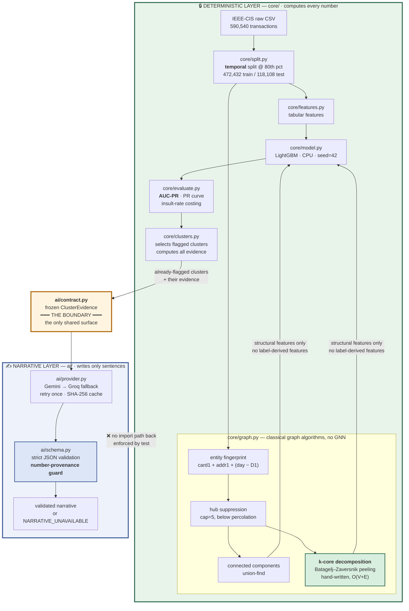

# RingWatch

**Graph-aware fraud ring detection with an enforced AI/determinism boundary.**

Razorpay AI Buildathon 2026 · Track 02 (AI Risk Manager)

> ## ⚠️ Detection-only
>
> RingWatch is **strictly a detection and analysis system.** It does not generate,
> simulate, optimize, or assist in producing adversarial, evasive, or fraudulent
> transactions, and contains no capability to do so. There is no attack simulation, no
> synthetic-fraud generation, and no adversarial-evasion tooling anywhere in this
> repository. This is both the Track 02 requirement and a design constraint the code
> structure honours.

---

## Problem statement

Card-testing rings, refund-abuse networks, and coordinated chargeback fraud don't look
like fraud one transaction at a time. Each individual payment can sit comfortably inside
a legitimate-looking distribution — modest amount, plausible merchant category, ordinary
hour — while the *coordination between* those payments is the only real signal. A
row-by-row classifier, no matter how well tuned, is structurally blind to it: it scores
each transaction independently and never sees that forty of them share a fingerprint.

RingWatch adds a classical graph layer over an entity graph to surface that coordination,
and — critically — measures honestly whether doing so actually helps.

## Headline result — including the part that didn't work

RingWatch set out to show that a classical graph layer improves fraud detection. **It
does not, and this README says so before it says anything else.**

Two findings, both measured, both defensible:

**1. Fraud genuinely clusters in the entity graph.** Testing *concentration* against a
label-permutation null: **12 fully-fraudulent connected components observed against
1.4 ± 1.2 expected by chance — z = +8.8**, stable across every hub-suppression cap tried
(+8.8 / +8.6 / +9.1). The ring structure is real.

**2. That structure does not convert into predictive lift.** Paired bootstrap, 400
resamples, both models scored on identical resampled test rows:

| variant | AUC-PR | Δ vs baseline | 95% CI | verdict |
|---|---|---|---|---|
| **tabular only** | **0.5188** | — | — | baseline |
| + components | 0.5176 | −0.0011 | [−0.0042, +0.0024] | not significant |
| + k-core | 0.5123 | −0.0064 | [−0.0102, −0.0031] | **significantly worse** |
| + full graph | 0.5168 | −0.0020 | [−0.0056, +0.0013] | not significant |

Baseline AUC-PR of 0.5188 against a 0.0344 prevalence floor is a **15.1× lift over
random**. The graph adds nothing to it.

These two results are not in tension. The rings are real but **rare** — 12 of them —
and the graph reaches only **5.38% of test rows**. Twelve rings cannot move a metric
averaged over 118,108 transactions, while 433 tabular features already capture most of
the available signal. On the linked subgroup alone the point estimate does turn positive
(0.4118 → 0.4298, **+0.017**), but its CI spans zero: 6,354 rows containing 136 fraud
cases cannot resolve an effect that small.

**What the graph layer is therefore used for here:** surfacing statistically anomalous
clusters for analyst review — which is what it demonstrably does — and *not* feature-level
lift, which it demonstrably does not. k-core is retained and reported as the measured harm
case rather than quietly deleted, but is excluded from the recommended model
configuration, because shipping a configuration measured as worse would be indefensible.

The alternative was to keep trying link keys, aggregates and caps until something scored
above baseline. With enough configurations one of them would, by chance. That is
p-hacking, and it would not survive the interview question "how many variants did you
try?" See `FAILURE_LOG.md`, entry dated 17:40.

## Data

[IEEE-CIS Fraud Detection](https://www.kaggle.com/competitions/ieee-fraud-detection) —
590,540 labeled transactions, 394 columns, **3.4990% fraud rate**, spanning 182 days.
Labels are real and externally authored: I did not create this data and cannot tune it to
flatter the model.

## Architecture

The central structural rule: **one box computes numbers, a completely separate box writes
sentences, and code — not convention — prevents the second from touching the first.**



**How the boundary is enforced** — not by convention, but by three mechanisms:

1. **One-way imports.** `core/` imports `ai.contract` to build the handover object.
   `ai/` never imports `core/`. `tests/test_ai_boundary.py` parses the AST of every
   module under `ai/` and fails if any of them imports the engine or a modelling library.
   The LLM has no code path to a score.
2. **Frozen evidence.** `ClusterEvidence` is an immutable dataclass. The narrative layer
   physically cannot mutate what it was given.
3. **Number-provenance guard.** Every numeric token in the model's prose must already
   appear in the evidence. An invented rupee total, an invented count — even *correct*
   arithmetic the model performed itself — is rejected. Two failures and the cluster gets
   `NARRATIVE_UNAVAILABLE` rather than a guess.

If the entire `ai/` package were deleted, every metric RingWatch reports would be
unchanged.

## Ground-truth honesty

**IEEE-CIS provides transaction-level fraud labels, not ring-level labels.** RingWatch
therefore will never claim a metric like "N fraud rings caught" — that number cannot be
validated against this dataset, and reporting it would be fabrication. The two claims
this project makes are the two it can actually defend:

1. Fraud-labeled transactions **cluster more densely** in the entity graph than
   legitimate ones, demonstrated through graph statistics.
2. Graph-derived features produce a **measured PR-AUC lift** over an identical tabular
   baseline, demonstrated by ablation on a temporally held-out test set.

## Why AUC-PR and not accuracy

At a 3.4990% positive class, a model that predicts "never fraud" for every single
transaction achieves **96.5% accuracy** while catching zero fraud. Accuracy is not a
weak metric here, it is an actively misleading one. RingWatch optimizes and reports
**AUC-PR** (area under the precision-recall curve), reports the full precision/recall
curve, and defends a specific chosen operating threshold rather than hiding behind a
single aggregate.

False positives are costed explicitly as an **insult rate**: at the chosen threshold, how
many legitimate customers were wrongly declined, and what that costs in rupees under
named, documented assumptions (see the constants block at the top of `core/evaluate.py`).

### Two operating points, because one would have been misleading

| | [A] cost-minimising | [B] insult-constrained (≤1%) |
|---|---|---|
| threshold | 0.0438 | 0.2167 |
| precision | 0.3082 | **0.6355** |
| recall | **0.6309** | 0.4178 |
| fraud caught / missed | 2,564 / 1,500 | 1,698 / 2,366 |
| **legitimate customers declined** | **5,756** | **974** |
| insult rate | 5.047% | 0.854% |
| total expected cost | ₹3,38,95,246 | ₹4,07,47,202 |

Point [A] minimises expected rupee cost and is **operationally unshippable**: no payments
team declines 5% of legitimate traffic. The arithmetic is right; the model is incomplete.
It prices a missed fraud at the full transaction value plus a chargeback fee, but prices a
false positive at only the lost gross margin — because the lifetime-value damage of
insulting a good customer is deliberately **not monetised**, as putting a number on churn
would be inventing data. An unpriced cost reads to an optimiser as a free one.

So both are reported. The gap between them *is* the honest statement of what the missing
cost is doing, and every insult figure here is an **underestimate**.

## Limitations

Written as they are discovered, not reconstructed at the end.

- **No ring-level ground truth.** See above. Every ring-topology claim is a statement
  about graph structure and measured lift, never a validated ring count.
- **Entity resolution is a heuristic.** The `card1 + addr1 + (day − D1)` fingerprint is
  the competition-validated proxy for a customer ID, but it is a proxy. It will merge
  distinct customers who collide on all three, and split one customer across values when
  `D1` is null (0.21% of rows) or `addr1` is null (11.13% of rows).
- **`addr1` has only 332 distinct values** across 590k transactions, so it is a weak,
  hub-forming identifier. Graph construction applies hub suppression to prevent hairball
  components; the thresholds are documented and are a judgment call, not a derived
  optimum.
- **The identity table is sparse** — it covers a minority of transactions. The graph is
  deliberately **not** built on `DeviceInfo` or `id_30`–`id_33` for this reason; those
  columns would produce a mostly-disconnected graph of noise.
- **Single dataset.** Findings are demonstrated on IEEE-CIS only.
- **The graph layer does not improve prediction.** Stated at the top of this README and
  measured with bootstrap confidence intervals rather than asserted. The honest scope of
  the graph contribution is cluster surfacing, not lift.
- **Graph coverage is 5.38% of test rows**, a direct consequence of choosing a hub cap
  below the percolation threshold. A higher cap reaches more rows but dissolves the
  components into a hairball; that trade-off is measured, not guessed, but it is a
  trade-off with no good corner.
- **The linked-subgroup result is underpowered.** The +0.017 point estimate on linked
  rows is the most promising number in the project and it is *not* statistically
  significant. It is reported as a hypothesis for future work, not as a finding.
- **The amounts are USD, converted for reporting.** IEEE-CIS is US e-commerce data
  (Vesta). Rupee figures apply a documented FX assumption; they illustrate the costing
  method, and are not claims about Indian transaction values.
- **Cost assumptions are assumptions.** Margin rate, chargeback fee and FX are declared
  constants a reviewer can disagree with and re-run. Churn cost is unpriced entirely,
  which makes every insult cost an underestimate.
- **`confidence` in the LLM output is unvalidated.** The field exists and is
  schema-checked, but nothing here measures how often "high" is actually right — that
  would need the grading layer this build did not have time for.

## Deployment

Reproducible from a clean clone on CPU alone. **No GPU, no cloud compute, no Kaggle
account.** End-to-end cold run is roughly 20 minutes, dominated by training four model
variants for the ablation.

### 1. Environment

```bash
git clone <this-repo> && cd ringwatch
python3 -m venv .venv && source .venv/bin/activate
pip install -r requirements.txt
```

Tested on Python 3.14.6 with pandas 3.0.5, numpy 2.5.2, scikit-learn 1.9.0,
LightGBM 4.7.0, networkx 3.6.1. Needs ~4 GB RAM and ~2 GB disk.

### 2. Data

```bash
python scripts/fetch_data.py
```

Downloads `train_transaction.csv` (652 MB) and `train_identity.csv` (26 MB) from an
ungated mirror of the IEEE-CIS competition data and verifies row counts. The canonical
source is Kaggle, which requires an authenticated account that has accepted the
competition rules; the mirror keeps this repo reproducible for reviewers who have
neither. Integrity is re-checked on load — row count and fraud rate are asserted against
published values, so a truncated download fails loudly rather than quietly degrading a
metric.

### 3. Run the pipeline

```bash
python run.py --stage data       # build the Parquet cache, print split statistics
python run.py --stage graph      # entity graph + ring-concentration test
python run.py --stage ablation   # the four-variant comparison and the negative case
python run.py --stage all        # everything
```

Every stage is deterministic (fixed seeds, `deterministic=True` in LightGBM) and caches
its expensive artifacts under `data/cache/`, so re-runs are fast and reproduce identical
numbers.

### 4. Narratives (optional)

The LLM layer is the only part that needs network access or credentials, and **nothing
in the metrics depends on it**:

```bash
cp .env.example .env    # add GEMINI_API_KEY and/or GROQ_API_KEY
python run.py --stage narrate
```

Without keys, this stage reports `NARRATIVE_UNAVAILABLE` for every cluster and the rest
of the pipeline is unaffected. Responses are cached by SHA-256 of the prompt, so repeat
runs are free and reproducible.

### 5. Tests

```bash
pytest -q
```

Covers temporal-split correctness (including no-leakage under tied timestamps), the
k-core implementation against networkx as an independent oracle, the ring-concentration
statistic on planted and null structure, LLM JSON schema validation, the
number-provenance guard, and the AI/determinism import boundary.

## Legacy

`legacy/ledgerloop/` holds an earlier, abandoned Track 04 project, retained deliberately
with its git history. It was working code, dropped on purpose — the reasoning is entry #1
of `FAILURE_LOG.md`.
