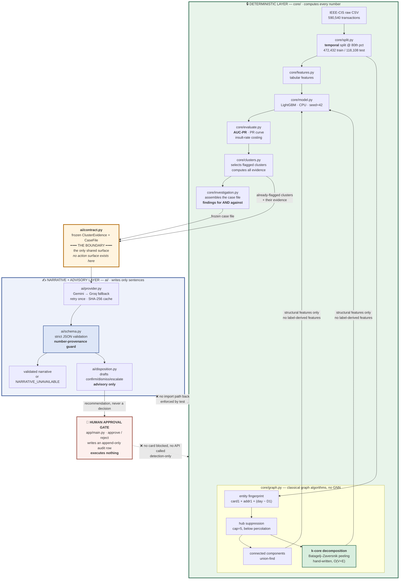
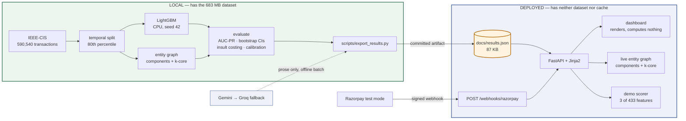

# RingWatch

**Graph-aware fraud ring detection with an enforced AI/determinism boundary.**

Razorpay AI Buildathon 2026 · Track 02 (AI Risk Manager)

**Live demo: https://ringwatch.onrender.com**
· [dashboard](https://ringwatch.onrender.com/) · [raw results JSON](https://ringwatch.onrender.com/api/results)
· `POST /webhooks/razorpay` webhook receiver

> On Render's free tier the instance spins down after ~15 minutes idle, so **the first
> request may take 30–60 seconds**. Subsequent requests are fast.

> **What is live vs what is local.** The deployed service **renders committed results,
> receives webhooks, and never retrains or recomputes any reported metric** — it has neither
> the 683 MB dataset nor the model cache, both of which are gitignored. Every figure on the
> dashboard comes from `docs/results.json`, produced locally by
> `scripts/export_results.py`. The full pipeline — download, temporal split, training, the
> four-variant ablation, the bootstrap — runs locally and takes several minutes of CPU.
>
> Stated at exactly that width. Two routes **do** run the committed booster —
> `POST /api/score` and the webhook's background task — and both are labelled demonstrations
> of the ingestion path at 0.69% feature coverage, whose output appears in no reported
> figure. This sentence previously read "never retrains, **rescores**, or recomputes a
> metric", which stopped being true when the scoring endpoint shipped in Phase 10. Caught in
> this project's own audit, recorded in `FAILURE_LOG.md`.
>
> On the free tier the instance spins down after ~15 minutes idle, so **a first request can
> take 30–60 seconds**. The SQLite webhook log is ephemeral and does not survive a restart.
> Neither affects a reported metric.

> ## ⚠️ Detection-only
>
> RingWatch is **strictly a detection and analysis system.** It does not generate,
> simulate, optimize, or assist in producing adversarial, evasive, or fraudulent
> transactions, and contains no capability to do so. There is no attack simulation, no
> synthetic-fraud generation, and no adversarial-evasion tooling anywhere in this
> repository. This is both the Track 02 requirement and a design constraint the code
> structure honours.

---

## Problem statement

Card-testing rings, refund-abuse networks, and coordinated chargeback fraud don't look
like fraud one transaction at a time. Each individual payment can sit comfortably inside
a legitimate-looking distribution — modest amount, plausible merchant category, ordinary
hour — while the *coordination between* those payments is the only real signal. A
row-by-row classifier, no matter how well tuned, is structurally blind to it: it scores
each transaction independently and never sees that forty of them share a fingerprint.

RingWatch adds a classical graph layer over an entity graph to surface that coordination,
and — critically — measures honestly whether doing so actually helps.

## Why the evaluation harness is the deliverable

Razorpay's engineering team published a detailed writeup of their Oncall Agent, **Project
Viveka** — a multi-agent system that investigates production incidents and takes what was
a roughly 30-minute manual investigation down to about 90 seconds. It is a genuinely
impressive piece of engineering, and the writeup is unusually candid about its own
maturity: the system runs in shadow mode, is validated through informal feedback in Slack
threads, and works toward an accuracy target that is aspirational rather than measured.
Razorpay stated all of that openly. It is an open question they raised themselves, and
one that anyone who has shipped an AI system into production has run into.

That candour is what makes the buildathon brief's thesis land: **verification capacity,
not generation speed, is the bottleneck** in AI-native financial systems. RingWatch takes
that seriously as a working discipline rather than a slogan, and it is the reason this
project's centre of gravity is the evaluation harness rather than the model. Concretely:

- **AUC-PR instead of accuracy**, because at a 3.44% positive class a model that never
  predicts fraud scores 96.5% and catches nothing.
- **Bootstrap confidence intervals instead of raw deltas**, because a single-run
  difference of 0.002 is a number, not a result.
- **An honest negative finding as the headline** — the graph layer, which is the most
  interesting thing I built, does not work — rather than an inconvenience tuned away
  until the metrics agreed with the hypothesis.
- **An explicit register of what is and isn't validated**, including a deliberate refusal
  to make any calibration claim about the language model's own `confidence` field, which
  this data cannot support (see [Calibration](#calibration-are-the-probabilities-trustworthy)).

RingWatch does not claim to have solved evaluation for production incident-response AI.
That is a substantially harder problem than fraud-ring detection — incidents are rarer,
far more heterogeneous, and lack the clean labels a fraud dataset hands you. This is an
attempt to hold a smaller, more tractable problem to the standard Razorpay named.

## Headline result — including the part that didn't work

RingWatch set out to show that a classical graph layer improves fraud detection. **It
does not, and this README says so before it says anything else.**

Two findings, both measured, both defensible:

**1. Fraud genuinely clusters in the entity graph.** Testing *concentration* against a
label-permutation null: **12 fully-fraudulent connected components observed against
1.4 ± 1.2 expected by chance — z = +8.8**, stable across every hub-suppression cap tried
(+8.8 / +8.6 / +9.1). The ring structure is real.

**2. That structure does not convert into predictive lift.** Paired bootstrap, 400
resamples, both models scored on identical resampled test rows:

| variant | AUC-PR | Δ vs baseline | 95% CI | verdict |
|---|---|---|---|---|
| **tabular only** | **0.5188** | — | — | baseline |
| + components | 0.5176 | −0.0011 | [−0.0042, +0.0024] | not significant |
| + k-core | 0.5123 | −0.0064 | [−0.0102, −0.0031] | **significantly worse** |
| + full graph | 0.5168 | −0.0020 | [−0.0056, +0.0013] | not significant |

Baseline AUC-PR of 0.5188 against a 0.0344 prevalence floor is a **15.1× lift over
random**. The graph adds nothing to it.


The four curves are indistinguishable by eye, which is the honest picture of this result.
Regenerate with `python scripts/make_pr_curve.py`.

These two results are not in tension. The rings are real but **rare** — 12 of them —
and the graph reaches only **5.38% of test rows**. Twelve rings cannot move a metric
averaged over 118,108 transactions, while 433 tabular features already capture most of
the available signal. On the linked subgroup alone the point estimate does turn positive
(0.4118 → 0.4298, **+0.017**), but its CI spans zero: 6,354 rows containing 136 fraud
cases cannot resolve an effect that small.

### "But did you try giving the graph more coverage?"

Yes — that is the first objection, so it was tested rather than argued about. Re-running
the full pipeline at higher hub-suppression caps:

| cap | coverage of test rows | AUC-PR | Δ (point) | Δ (bootstrap) | 95% CI |
|---|---|---|---|---|---|
| 5 *(shipped)* | 5.38% | 0.5168 | −0.0020 | −0.0020 | [−0.0056, +0.0013] |
| 20 | 15.41% | 0.5191 | **+0.0003** | +0.0002 | [−0.0041, +0.0039] |
| 50 | 26.18% | 0.5152 | −0.0036 | −0.0036 | [−0.0073, +0.0000] |

The confidence intervals are new as of the Phase 11 audit, and they matter: the claim
"inside the noise band" used to be an appeal to the ablation's ±0.004 and is now directly
checkable on this table's own rows. **Every interval spans zero.** Two delta columns are
shown because two different quantities get called "the delta" — the point estimate (one
model's AUC-PR minus the other's) and the mean of 400 paired resampled differences, which
is the one the CI belongs to. They agree at four decimals on two of three rows, and the
cap-20 row is where they do not: +0.0003 against +0.0002. Both are reported rather than
one being quietly picked.

Tripling coverage moves AUC-PR by +0.0003 — an order of magnitude *inside* the noise band,
with a CI of [−0.0041, +0.0039] that spans zero — and the cap-20 run exhausted its 2,000
boosting rounds without early stopping, making it the less trustworthy of the three.
Quintupling coverage makes things actively worse.

**Coverage is not the binding constraint.** The +0.0003 is reported here precisely
*because* it is positive and meaningless: selecting it as "the graph helps at cap 20"
would be exactly the p-hacking this project refused to do.

```bash
python scripts/coverage_sweep.py          # regenerates this table
```

That script exists because of the Phase 11 audit, and the reason is worth stating rather
than hiding. **This was the one table in the project with no reproducible path.** Every
other figure regenerates from `run.py` or `scripts/export_results.py`; these three rows had
been produced by editing `MAX_GROUP_SIZE` in `core/graph.py` by hand and writing the result
down — which makes them a published claim a reviewer has to take on trust, in a project
whose entire argument is that you should not have to. The hub cap is now a parameter of
`build_features_for_split` (default unchanged, asserted by test), and the sweep is a driver
that calls the same training, evaluation and bootstrap the shipped ablation uses.

### Where the harm actually comes from

The ablation prints a breakdown of *where* graph features move scores, and the answer
was not the one the design predicted:

| group | rows | mean abs. Δ score | legit rows pushed >0.10 toward decline |
|---|---|---|---|
| **no entity resolved** | 12,234 | **0.0161** | **1.046%** |
| isolated (comp=1) | 99,520 | 0.0046 | 0.189% |
| comp 2 | 1,620 | 0.0050 | 0.316% |
| comp 3–4 | 2,963 | 0.0050 | 0.137% |
| comp 5+ | 1,771 | 0.0053 | 0.233% |

The largest perturbation — 3.5× any other group — is on rows where **no entity could be
resolved at all**, i.e. precisely where the graph has nothing to say. Graph columns are
NaN there, and the model re-learns the genuinely predictive missingness pattern (those
rows run 11.63% fraud vs 3.50% overall) more noisily than it already had from the null
`addr1`/`D1` columns. **That is noise injection, not ring confusion.**

The hypothesised failure mode — a legitimate customer inside a real cluster pushed toward
decline by topology alone — *does* occur, and the pipeline prints those rows too (e.g. a
27-entity component, core 2, legitimate, pushed 0.0818 → 0.2115). It is simply not the
dominant effect. Reporting the predicted case without the dominant one would have been
the tidier story and the wrong one.

**What the graph layer is therefore used for here:** surfacing statistically anomalous
clusters for analyst review — which is what it demonstrably does — and *not* feature-level
lift, which it demonstrably does not. k-core is retained and reported as the measured harm
case rather than quietly deleted, but is excluded from the recommended model
configuration, because shipping a configuration measured as worse would be indefensible.

The alternative was to keep trying link keys, aggregates and caps until something scored
above baseline. With enough configurations one of them would, by chance. That is
p-hacking, and it would not survive the interview question "how many variants did you
try?" See `FAILURE_LOG.md`, entry dated 17:40.

## Data

[IEEE-CIS Fraud Detection](https://www.kaggle.com/competitions/ieee-fraud-detection) —
590,540 labeled transactions, 394 columns, **3.4990% fraud rate**, spanning 182 days.
Labels are real and externally authored: I did not create this data and cannot tune it to
flatter the model.

## Architecture

The central structural rule: **one box computes numbers, a completely separate box writes
sentences, and code — not convention — prevents the second from touching the first.**



### The latency boundary

The two halves of the system run on completely different clocks, and conflating them is
how "AI-powered fraud detection" ends up meaning "an LLM is in your payment path." It is
not. The fast path never waits for the model.

```mermaid
sequenceDiagram
    autonumber
    participant RZP as Razorpay
    participant API as FastAPI receiver
    participant G as core/graph_incremental
    participant DB as SQLite
    participant LLM as Gemini

    rect rgb(237, 245, 239)
    note over RZP,DB: FAST PATH — deterministic, in the request
    RZP->>API: POST /webhooks/razorpay (raw bytes)
    API->>API: HMAC-SHA256 over raw body (~µs)
    API->>DB: INSERT event_id (PK collision = replay)
    API-->>RZP: 200 accepted
    note right of API: returned BEFORE any analysis;<br/>Razorpay disables endpoints >5s
    end

    rect rgb(238, 241, 249)
    note over API,LLM: SLOW PATH — after the response is sent
    API->>G: insert_edge(u, v)
    G-->>API: core numbers repaired — 2.0 µs/edge
    note right of G: local subcore repair,<br/>2.8 candidates touched,<br/>not an O(V+E) rebuild
    API->>LLM: narrate(frozen evidence)
    LLM-->>API: schema-validated JSON prose
    note right of LLM: seconds. Never on the<br/>request path, never near a number.
    end
```

The gap is roughly six orders of magnitude: **2.0 µs** to repair the graph against
**seconds** for prose. That is the entire argument for keeping them apart.

### The stack, as it actually runs



The orange artifact in the middle is the whole architecture: **everything left of it
computes, everything right of it renders.** `data/raw/` and `data/cache/` are gitignored,
so the deployed instance physically cannot recompute a reported metric even if the code
tried.

**How the boundary is enforced** — not by convention, but by three mechanisms:

1. **One-way imports.** `core/` imports `ai.contract` to build the handover object.
   `ai/` never imports `core/`. `tests/test_ai_boundary.py` parses the AST of every
   module under `ai/` and fails if any of them imports the engine or a modelling library.
   The LLM has no code path to a score.
2. **Frozen evidence.** `ClusterEvidence` is an immutable dataclass. The narrative layer
   physically cannot mutate what it was given.
3. **Number-provenance guard.** Every numeric token in the model's prose must already
   appear in the evidence. An invented rupee total, an invented count — even *correct*
   arithmetic the model performed itself — is rejected. Two failures and the cluster gets
   `NARRATIVE_UNAVAILABLE` rather than a guess.

No number RingWatch reports is produced, computed, or altered by the language model — the
AI layer only writes prose about numbers `core/` already finalized, and this boundary is
enforced by a test that walks the import graph, not by a comment asking nicely.

## The narrative layer, on real output

Running `python run.py --stage narrate` against the 12 clusters the deterministic engine
flagged: **11 of 12 produced validated narratives; 1 returned `NARRATIVE_UNAVAILABLE`**
after two Gemini timeouts. That failure was not staged — it is the degradation path
firing on a real transient network fault, which is better evidence than a unit test that
it works.

Two behaviours worth noting in the real output:

- **The number-provenance guard passed on all 11.** Every figure quoted in the prose
  (`48114.00 INR`, `k-core number of 2`, `max risk score of 0.7464`) was present in the
  evidence the model was handed. Nothing was invented, and nothing was derived.
- **The model frequently answers `BENIGN_COINCIDENCE`.** Most flagged clusters were
  described as ordinary shared household or business infrastructure rather than
  coordinated fraud. That is the prompt working as intended: telling an analyst a cluster
  is unremarkable is more useful than manufacturing a story for it, and a narrative layer
  that called everything fraud would be worthless.

Example (cluster 8, `SHARED_CREDENTIAL_REUSE`, confidence medium):

> Cluster 8 consists of 3 entities connected across 12 transactions over an activity span
> of 26 days, accumulating a total amount of 48114.00 INR. The graph topology shows a
> connected component size of 4, a k-core number of 2, and a max entity degree of 2, where
> all entities share card1, addr1, and P_emaildomain… The model flagged 6 transactions in
> this cluster, generating a mean risk score of 0.3318 and a max risk score of 0.7464.
>
> **Suggested action:** Inspect the 3 linked entities sharing card1 and addr1 to confirm
> user authorization or credential compromise.

Every number in that paragraph was computed by `core/`. The model chose the words.

## The investigation orchestrator — the guardrail is the feature

RingWatch has one agentic component. It reads a case file and drafts a recommended
disposition — **confirm**, **dismiss** or **escalate** — with reasoning. What makes it worth
building is not what it can do; it is what it structurally cannot.

**Four prohibitions, none of them policy:**

| It cannot… | Because |
|---|---|
| Compute or alter a score | `ai/`'s entire *transitive* import closure is the standard library plus `requests`. No `core`, no `numpy`, no LightGBM. There is no scoring code reachable from it. |
| Select or deselect a cluster | Selection happened in `core/clusters.py` before it ran, at the insult-constrained threshold. |
| Execute anything | There is no action surface in `ai/contract.py`. No client, no callback, no write path. It returns a frozen dataclass. |
| State a number it was not given | Every numeric token in the rationale *and* in every `key_factor` must appear in the case file, or the response is rejected. |

`tests/test_ai_boundary.py` enforces the first by walking the import graph — and it passes
**unchanged** after this layer was added, which was the condition for building it at all.

### The case file argues both ways, on purpose

`core/investigation.py` derives two lists of factual statements from figures the engine
already computed: findings supporting concern, and findings arguing against it. On the 12
flagged clusters that is **37 supporting and 22 against**, with 10 of 12 clusters carrying
at least one against-finding.

This is not decoration. A case file that assembles only incriminating detail is a
prosecutor's brief, and an investigation tool that only ever builds one is *worse than no
tool* — it manufactures the confidence a reviewer then rubber-stamps. So a 20-day activity
span is recorded as "longer than a typical card-testing burst," a single shared card across
several entities gets its innocent explanation ("one household or a shared business
account"), and a cluster where only 1 of 3 transactions was flagged is recorded as mostly
ordinary activity.

They are *facts handed to the drafter*, not the drafter's opinions about the evidence. That
distinction is what makes it safe to reason from them while still being unable to produce a
number.

### What it actually did

All **12 of 12 drafts validated** — no invented figures, no schema violations, no
correction rounds needed.

| Recommendation | Count |
|---|---|
| escalate | 9 |
| dismiss | 2 |
| confirm | 1 |

**Mostly "escalate" is the honest answer, not a failure to decide.** With no ring-level
ground truth, a cluster of two entities sharing a card over 20 days genuinely *is*
ambiguous, and a layer that confidently confirmed it would be manufacturing certainty the
evidence does not contain. Self-reported confidence was `medium` on 10 of 12 — and, as with
the narrative layer, that field is left deliberately unvalidated for the reasons in
[Why the LLM's `confidence` field is left unvalidated](#why-the-llms-confidence-field-is-left-unvalidated).

Of the 10 clusters that carried an against-finding, **all 10 drafts engaged with one**. The
two `dismiss` recommendations both lean on it explicitly:

> …the overall pattern strongly aligns with ordinary shared infrastructure such as a
> household or shared business account. The activity span of 20 days is far longer than a
> typical card-testing burst, and only 1 of 3 transactions was flagged by the model.

### How much the provenance guard actually catches — measured, because widening it was a real risk

`CaseFile.allowed_numbers()` is a deliberately *wider* allow-set than `ClusterEvidence`'s:
it adds rank, percentile, cross-cluster overlap, and every figure quoted inside the derived
findings. A guard that widens until it stops rejecting anything is theatre, so this was
measured rather than assumed.

Across the 12 real case files the allow-set grew from 17–21 tokens to 21–31 (median 27).
Against that:

| test | result |
|---|---|
| Randomly sampled plausible figures (counts, risk scores, rupee amounts) | **0.12% accepted** — 23 of 20,000 |
| A figure borrowed from a *different* cluster, above 10 | 29% accepted |
| A figure borrowed from a different cluster, 0–10 | **100% accepted** |

**The guard prevents fabrication and does not prevent misattribution.** Those are different
failures and only the first is claimed. Inventing `Rs 4,20,000` out of nothing is caught
essentially always; quoting cluster 3's 26-day span while writing about cluster 8 is not
caught at all, because the guard checks provenance against *this* case file, not identity
across case files, and small clusters genuinely share figures.

The 0–10 row is the documented unconditional allowance — those integers appear in ordinary
prose ("two of the three cards") and banning them would reject valid output without
preventing meaningful fabrication. It is the right trade, and it is also precisely why the
misattribution number is 100% there. Both numbers are pinned in
`tests/test_investigation.py` so neither can quietly drift.

### The approval gate

Every draft sits behind an explicit human approve/reject in the dashboard, drawn as the
loudest element on the page — heavy border, hatched ground, the word DRAFT before the verb.

**Approving executes nothing.** It writes one row to an append-only audit trail: the draft,
the exact case file the model saw, who decided, and when. No card is blocked, no customer is
contacted, no Razorpay API is called. The `/api/dispositions/{case_id}/decision` response
says so in the payload (`"applied": false`).

Two details that matter more than they look:

- **The draft and the evidence are read server-side from the committed artifact, never from
  the request.** A client cannot rewrite the record of what the model said or what it was
  shown. `tests/test_audit.py` posts a forged body and asserts it is ignored.
- **The trail is append-only by shape, not by convention.** There is no `UPDATE` or `DELETE`
  against that table anywhere in `app/store.py`, and a test asserts it. A reviewer changing
  their mind adds a row. An audit log you can edit cannot answer the question an audit asks.

`app/main.py` is also asserted to import no HTTP client, no mail library and no payment SDK
— pinned as a test because "approve" is exactly the button someone would later wire to a
real block. If that day comes, the test fails first and the caveat gets updated rather than
quietly becoming false.

Roughly 2% of financial-services AI deployments are fully autonomous. The reason is this
one, and RingWatch does not pretend otherwise.

## The webhook: what transfers to a new payment ecosystem, and what doesn't

The Razorpay webhook receiver is a real integration, not a decoration. Signatures are
verified with HMAC-SHA256 over the **raw request bytes** using `hmac.compare_digest`;
delivery is idempotent on `x-razorpay-event-id` because Razorpay delivers at-least-once;
and the endpoint returns 200 **before** any analysis runs, because Razorpay disables
endpoints slower than about five seconds.

The raw-body detail is the one worth dwelling on. Parsing the JSON and re-serialising it
produces different bytes for the same document — reordered keys, normalised whitespace,
`249900.00` collapsed to `249900.0` — so the HMAC no longer matches and verification fails
on payloads nobody tampered with. It presents as intermittent failures that look like an
upstream problem. `tests/test_webhook.py::test_reserialized_body_fails_verification`
reproduces exactly that and asserts the failure, so the constraint is pinned in executable
form.

### Building it surfaced a result worth reporting

The obvious feature — "score incoming payments with the trained model" — turns out not to
be honestly possible, and finding out why is more interesting than the feature would have
been.

**The classifier expects 433 features. A Razorpay payment payload supplies 3.** `card1`,
`card2` and `card5` are Vesta-internal identifiers, not card network or type; `addr1/2` and
`dist1/2` likewise; `C1–C14`, `D1–D15`, `M1–M9` and `V1–V339` — roughly 400 columns — are
Vesta's proprietary engineered features with no counterpart in any processor's webhook.
LightGBM will accept 430 missing values and return a number, but that number comes from a
model operating almost entirely outside its training distribution.

So the handler runs two tracks and the interface never lets them blur:

| | what it is | what it can claim |
|---|---|---|
| **Track 1 — graph structure** | Connected components and k-core over an entity graph built from Razorpay-native identifiers (card fingerprint, email domain, contact, VPA), using the **same implementations validated against networkx** in the test suite | A real computation. Topology assumes no distribution and was fitted to nothing, so it transfers intact |
| **Track 2 — model score** | The booster run with 430 features missing | **A demonstration of the ingestion path only.** Shown with a measured coverage figure — *"3 of 433 features present"* — not a vague disclaimer |

Verified locally on two test-mode payments from different payers sharing one card
fingerprint: Track 1 correctly placed them in a single component (size 2, core 2, linked on
`card_fingerprint` and `email_domain`), while Track 2 returned 0.0066 at **0.7% feature
coverage**.

**The contrast is the finding: the graph algorithms transfer across payment ecosystems, the
trained model does not.** Reporting that is more useful than quietly displaying a number
that means nothing — and stating it is the same discipline as reporting the negative
ablation above.

## Replication on a second dataset — Elliptic

RingWatch's structural claim rests on a graph it had to **invent**: IEEE-CIS ships no edges,
so the entity graph is inferred from a `card1 + addr1 + (day − D1)` fingerprint and then
hub-suppressed to stop it percolating. Every finding therefore depends on that heuristic
being reasonable, which the README previously asserted rather than measured.

The Elliptic Bitcoin dataset (203,769 nodes, 234,355 **observed** edges) removes entity
resolution as a confound. `PLAN_ELLIPTIC.md` records the predictions before any code ran.

### It does not close the ground-truth gap, and that was checked first

Elliptic's labels are `illicit` / `licit` / `unknown` attached to **transactions** — exactly
like `isFraud`. There is no ring, cluster or actor identifier. **The ring-level limitation
stands unchanged.** What Elliptic offers is a real graph, not real ring labels.

### The finding: clustering replicates on a graph nobody invented

| graph | illicit–illicit edge rate | permutation null | z |
|---|---|---|---|
| **Elliptic** (observed money flows) | 0.0272 | 0.0095 ± 0.0007 | **+24.9** |
| **IEEE-CIS** (inferred, projected) | 0.0036 | 0.0007 ± 0.0002 | **+17.0** |

Illicit activity clusters far beyond chance on **both** — including the one whose edges were
observed rather than guessed. The structural finding is not an artifact of the fingerprint
heuristic.

### The existing statistic broke, and the failure was informative

Running the project's own `ring_concentration_test` on Elliptic returned **z = +0.0**, which
reads like a clean null and is nothing of the sort. That statistic counts components in
which *every* labelled member is illicit — sound when components average ~5 entities, as
they do on IEEE-CIS. Elliptic's transaction-flow graph percolates: **49 components averaging
950 labelled members**, largest 7,880. No component there could be all-illicit, and the null
predicts none either. Zero against 0 ± 0 gives z = 0 **because the test has no power**, not
because there is no clustering.

Reporting that as "no concentration" would have been a false negative dressed as a finding.
So the replication uses an edge-level homophily statistic whose unit is the edge rather than
the component, which works at any component size — and it is run on **both** graphs so the
comparison is like-for-like. A test pins the degeneracy so it cannot be forgotten.

One more wrinkle: RingWatch's graph is **bipartite** (entities touch attribute nodes, never
each other), so an edge statistic on its raw form finds zero entity–entity edges and returns
`nan`. It is projected onto entities first — two linked when they share an attribute, which
is what an edge there already means.

### Graph quality: inferred vs observed

| | IEEE-CIS (inferred) | Elliptic (observed) |
|---|---|---|
| nodes | 208,914 | 203,769 |
| edges | 29,285 | 234,355 |
| mean degree | 0.280 | 2.300 |
| isolated nodes | **87.7%** | 0.0% |
| components ≥2 | 4,935 | 49 |
| largest component | 69 | **7,880** |
| mean component size | 5.2 | 4,158.6 |
| max k-core number | 3 | 9 |

This is the measurement that replaces an assertion. The inferred graph is **an order of
magnitude sparser** with 87.7% of entities isolated, while the observed graph percolates
into a handful of giant components. Neither is "better" — they are different objects, one a
set of accounts *guessed* to share an actor, the other money that *demonstrably moved*. But
the contrast is also an argument **for** hub suppression arrived at from the opposite
direction: without it, an entity graph tends toward exactly the percolated shape that made
the component statistic useless here.

All four pre-registered predictions held: stronger z on Elliptic, far larger components,
a much sparser inferred graph, and a deeper k-core.

## Drift across the held-out period — and a metric that lies about it

The model trains once on the first 141 days and is evaluated on the next 42. A single
aggregate score hides whether performance holds up. `python run.py --stage drift` cuts the
held-out period into six calendar windows and measures each.

| window | days | rows | fraud | prevalence | AUC-PR | AUC-ROC | ROC 95% CI | ECE |
|---|---|---|---|---|---|---|---|---|
| 1 | 141–148 | 18,525 | 636 | 3.43% | 0.4523 | 0.8876 | [0.875, 0.901] | 0.0138 |
| 2 | 148–155 | 21,360 | 662 | 3.10% | 0.5609 | 0.9055 | [0.890, 0.920] | 0.0082 |
| 3 | 155–162 | 19,697 | 562 | 2.85% | 0.4821 | 0.8923 | [0.875, 0.911] | 0.0057 |
| 4 | 162–169 | 21,020 | 736 | 3.50% | 0.5037 | 0.8910 | [0.878, 0.904] | 0.0103 |
| 5 | 169–176 | 19,824 | 724 | 3.65% | 0.5503 | 0.8977 | [0.884, 0.910] | 0.0115 |
| 6 | 176–183 | 17,682 | 744 | 4.21% | 0.5582 | 0.8965 | [0.883, 0.910] | 0.0146 |

### The finding: no model drift, but real label drift

**Ranking quality does not change.** AUC-ROC sits between 0.8876 and 0.9055 across every
window, and the first and last intervals overlap comfortably. **Feature distributions do
not move either** — the largest PSI anywhere is 0.0531, well inside the conventional
"stable" band below 0.10.

**What does move is the base rate.** Fraud prevalence climbs from 3.43% to 4.21%, +22.6%
across the period. That is genuine label drift in a 42-day window, and it is the thing a
deployed system would need to react to.

### The metric that would have lied, and the correction that also lied

Raw AUC-PR rises **+23.4%** across the same period — 0.4523 to 0.5582, with intervals that
do *not* overlap. Read naively, "the model improved 23% over the held-out period."

It didn't. **AUC-PR's floor is prevalence**, so it moves with the base rate whether or not
the model changed, and prevalence moved +22.6%. The two track each other almost exactly.

The obvious correction — divide AP by prevalence — is *also* wrong, which took a controlled
experiment to establish rather than an argument. With a fixed-quality ranker and prevalence
rising 2% → 6%:

| ranker | AP range | lift = AP/prevalence |
|---|---|---|
| weak | 0.03–0.07 | 1.3× → 1.2× (flat — ratio works) |
| strong | 0.60–0.75 | 29.9× → 12.5× (**ratio badly over-corrects**) |

The ratio only holds at low AP. This project runs at ~0.5, squarely in the regime where it
fails. So the trend verdict uses **AUC-ROC**, which is invariant to class balance by
construction rather than by approximation. `core/drift.py` reports lift for context but
never uses it to decide anything.

PSI is hand-implemented and validated against `scipy.stats.entropy` via the identity
**PSI = Jeffreys divergence = KL(a‖b) + KL(b‖a)** — there is no PSI in any standard
library, so that identity is what makes an independent oracle possible at all.

**This is a diagnostic, not a retraining pipeline.** Nothing here refits a model or adapts
a threshold.

## Cost-sensitive training: it made things worse, and the reason is measurable

Cost asymmetry previously entered only at threshold selection. This makes the *model* carry
it, weighting each training row by what getting it wrong would cost — a fraud row by
`amount + chargeback fee`, a legitimate row by `amount × gross margin`, using the **same
named constants** the threshold logic uses so the two cannot disagree about what a mistake
is worth. Same feature set as the baseline, so only the weighting differs.

Run it with `python run.py --stage cost`.

| variant | AUC-PR | Δ | 95% CI | verdict |
|---|---|---|---|---|
| tabular only | 0.5188 | — | — | baseline |
| + cost-sensitive | 0.4782 | **−0.0408** | [−0.0472, −0.0341] | **significantly worse** |

And on the axis it is actually optimising — total expected cost at the ≤1% insult cap:

| variant | threshold | insult rate | recall | total expected cost |
|---|---|---|---|---|
| tabular only | 0.2167 | 0.854% | 0.4178 | ₹4,07,47,202 |
| + cost-sensitive | 0.6800 | 0.974% | 0.3841 | ₹4,47,04,444 |

**+9.71% more expensive.** It loses on the metric it was built to win.

### Why — and this is measurable, not a guess

Weighting does not add information; it redistributes attention. Skewed weights redistribute
it into a *smaller* effective dataset, and the Kish effective sample size measures exactly
how much:

> **55,864 effective rows out of 472,432 — 11.8% of nominal.**

Cost weighting discards roughly seven-eighths of the effective training set. A legitimate
row's weight is its amount × 0.12, while a fraud row's is its amount + a fixed ₹1,200 fee,
which produces a **172,000× spread**; the heaviest 1% of rows end up holding 20% of all the
weight. Early stopping corroborates it — the model halts at 161 boosting rounds against the
baseline's 633, exactly what starved, noisier gradients look like.

So the cost signal was real but cheap, and the information destroyed to encode it was
expensive. A much weaker model cannot be rescued by knowing what things cost.

**What this does not license:** "cost-sensitive learning doesn't work." What was measured is
*one weighting scheme on one dataset* costing more information than its signal was worth.
A scheme that capped the weight ratio, or applied cost only through a custom objective
rather than row weights, might well behave differently — and `effective_sample_size()` in
`core/costs.py` is the diagnostic to check first.

## Does the graph layer matter where the money is?

AUC-PR is **count-uniform** — it treats a small fraud and a large one identically. PayPal's
engineers report optimising for "dollar-weighted fraud detection", which raises a fair
objection to the negative result above: perhaps the graph layer only looks useless because
the metric ignores value. Fraud rings might plausibly target larger amounts.

Predictions were recorded in `PLAN_VALUE_WEIGHTED.md` before measuring. Run it with
`python run.py --stage value`.

### First, the mechanism — and it settles most of the question

| | share of fraud **count** | share of fraud **value** |
|---|---|---|
| graph-linked rows | 3.35% | **3.57%** |

A **1.07× enrichment**. Mean fraud amount 160.18 for linked rows against 149.73 for
isolated. Value weighting can only change a conclusion if the subgroup it favours carries
disproportionate value, and this one does not.

### The full table

Weighted by raw `TransactionAmt`. VDR is a ratio, so units cancel and **no exchange-rate
assumption is used anywhere in this section** — strictly fewer premises than the rupee
costing elsewhere in this README.

| variant | AUC-PR | value-weighted AUC-PR | recall @ cap | VDR @ cap |
|---|---|---|---|---|
| tabular only | 0.5188 | 0.4326 | 0.4178 | 0.3242 |
| + components | 0.5176 | 0.4353 | 0.4254 | 0.3233 |
| + k-core | 0.5123 | 0.4368 | 0.4173 | 0.3228 |
| + full graph | 0.5168 | 0.4369 | 0.4213 | 0.3329 |
| + centrality | 0.5134 | **0.4450** | 0.4163 | 0.3302 |

### At the operating point that would actually ship

Value-weighted AUC-PR is threshold-free — it asks whether a model *ranks* high-value fraud
better. The operational question is narrower: **at the threshold we would deploy, does it
stop more of the money?** That is the value detection rate, bootstrapped at the existing
≤1% insult cap with each model holding its own threshold.

| variant | VDR @ cap | Δ | 95% CI | corrected | survives |
|---|---|---|---|---|---|
| tabular only | 0.3242 | — | — | — | baseline |
| + components | 0.3233 | −0.0009 | [−0.0190, +0.0159] | [−0.0273, +0.0212] | no |
| + k-core | 0.3228 | −0.0016 | [−0.0198, +0.0153] | [−0.0220, +0.0196] | no |
| + full graph | 0.3329 | +0.0088 | [−0.0099, +0.0261] | [−0.0145, +0.0295] | no |
| + centrality | 0.3302 | +0.0060 | [−0.0117, +0.0255] | [−0.0162, +0.0291] | no |

**Nothing is significant, corrected or uncorrected.** At the shippable threshold the graph
layer stops the same share of fraud value as the tabular baseline. `+ full graph` posts the
largest point estimate, and its interval spans zero even before correcting for the family.

One limitation stated rather than buried: each threshold is chosen once on the full test set
and held fixed across resamples. That isolates the metric difference, but it means these
intervals **exclude threshold-selection uncertainty** and are narrower than what a real
deployment would face.

### The result that nearly became a false headline

`+ centrality` — hand-implemented PageRank and Brandes betweenness, the algorithms PayPal
names for ring detection — came back **significantly better under value weighting**
(+0.0125, 95% CI [+0.0024, +0.0220]) while being **significantly worse** on counts. That is
precisely the dramatic "the graph matters where the money is" story, and it would have made
a compelling claim.

**It does not survive multiplicity correction.** Four variants under two weightings is
**eight comparisons**; at 95% each, the chance of at least one false positive is ~34%.
Corrected across that family, the centrality value interval becomes **[−0.0022, +0.0257] —
it spans zero.** Two-sided bootstrap p ≈ 0.012 against a corrected threshold of 0.00625.

What *does* survive correction is unflattering in the other direction: **both k-core and
centrality are significantly harmful on the count metric.**

So the conclusion is unchanged, and now it has survived its most serious challenge: **no
graph variant produces a value-weighted lift that holds up under the number of tests
actually run.** The pre-registration committed in advance to treating any positive as
hypothesis-generating rather than confirmatory, which is the only honest way to report the
one hit out of eight.

### Two predictions I got wrong

**Betweenness is not mostly zero.** I predicted >70% of linked entities would have zero
betweenness, reasoning about a projected entity-to-entity graph where a 4-node component
leaves nothing to sit between. Only **19.2%** are zero — because the graph is *bipartite*,
so a chain `uid → attribute → uid → attribute → uid` makes the middle entities genuine
intermediaries. I was reasoning about the wrong topology.

**PageRank, though, is as constant as predicted**: median within-component coefficient of
variation is **0.0000**. Across components averaging 3.2 entities there is simply nothing
for it to distinguish.

### Caveats

- `TransactionAmt` is anonymised and possibly transformed. This is evidence about **value
  structure in the dataset**, never a claim about literal money saved.
- This is a **second metric run after the first returned null**, which is structurally the
  move this project refused elsewhere. It is defensible only because the predicted null was
  recorded first and because `core/evaluate.py` already weighted by amount for insult
  costing — value-awareness was an existing commitment, not an escape route.
- Value-weighted intervals are **2.3–2.6× wider** than count-weighted ones, as predicted:
  the top 1% of frauds carry ~11% of fraud value, so resampling them swings the estimate
  hard. The value metric is *less* sensitive, not more.
- **Not publicly documented ≠ absent.** Razorpay very likely has internal value-weighted
  evaluation; the comparison here is against public documentation only.
- Deliberately out of scope, and named rather than skipped: production **GNNs** and PayPal's
  **real-time graph database** are real capabilities that a solo CPU build cannot reproduce.

## Incremental k-core maintenance

Production fraud graphs update continuously; RingWatch rebuilds in batch. So the k-core
implementation was extended to maintain core numbers **incrementally** under edge
insertion, using the traversal/subcore approach from the streaming core-maintenance
literature (Sarıyüce et al.; Zhang et al. for the order-based alternative).

It rests on one result: inserting an edge (u, v) raises any core number by **at most 1**,
and only for vertices whose core number equals `min(core(u), core(v))`. That bounds the
blast radius, so a local repair is possible — collect the candidate subcore, peel it, and
promote the survivors.

### Correctness: exact, against the batch oracle

`core/graph.py` is untouched and serves as the oracle. Incremental core numbers must equal
a full rebuild **exactly**, at three tiers — random graphs asserted after *every single
insertion*, the pathological fixtures reused from the batch suite (barbell, wheel,
lollipop, karate, complete bipartite, ladder, star, path), and the real IEEE-CIS entity
graph replayed edge by edge. 37 tests, all exact-equality. The chain of trust runs
networkx → batch → incremental.

### The benchmark, and a prediction I got wrong

`PLAN_INCREMENTAL.md` recorded a prediction *before* any measurement: that incremental
maintenance would lose on this graph. **It was wrong, and by a wide margin.**

| graph | candidates/insert | per-insert | vs full rebuild |
|---|---|---|---|
| dense random — 20k nodes, 60k edges | 9,543 | 21,887 µs | crossover at **3 edges** |
| dense random — 5k nodes, 15k edges | 2,109 | 3,485 µs | bulk replay **667× slower** |
| sparse, entity-graph-shaped | 2.8 | 4.4 µs | crossover at 67% of edges |
| **real IEEE-CIS entity graph** | **2.8** | **2.0 µs** | **2.8× faster** (0.058 s vs 164 ms) |

I predicted a crossover at 1–5% of total edges; it is **282%** — you would have to insert
nearly three times the entire graph before batching became cheaper. Memory overhead is
+0.1 to +4.0 MB depending on size.

**The reason is density, and it inverts the answer.** On the real graph the affected
subcore per insertion is 2.8 vertices, so repairing three vertices beats peeling 208,914.
On dense graphs the "local" repair is not local — most vertices share a core number, the
candidate set becomes a large fraction of the graph, and every insertion re-peels it. My
error was noting the graph's sparsity and then not carrying the consequence through.

### When this is and isn't worth using

**Worth it:** sparse entity graphs with small components — which is what payment
fingerprint graphs actually look like — under genuine streaming, where updates arrive a few
at a time. At 2.0 µs per edge this comfortably keeps up with real transaction volume.

**Not worth it:** dense graphs, or bulk backfills. Above the crossover, rebuild. On a dense
graph incremental is catastrophically worse, not marginally so.

**Unmeasured, and a real limit on the claim:** the replay uses the **post-suppression**
edge set, so it never exercises a cap-crossing — yet the batch graph suppresses **8,852 hub
values**, each of which a faithful stream would hit as an edge *deletion*. Deletion is a
harder problem and is not implemented. The measured 2.8× is therefore an upper bound on
what a real streaming deployment would see.

```bash
python scripts/benchmark_incremental.py
```

## Ground-truth honesty

**IEEE-CIS provides transaction-level fraud labels, not ring-level labels.** RingWatch
therefore will never claim a metric like "N fraud rings caught" — that number cannot be
validated against this dataset, and reporting it would be fabrication. The claims this
project makes are the ones it can actually defend:

1. Fraud-labeled transactions **cluster more densely** in the entity graph than
   legitimate ones — z = +8.8 against a label-permutation null, stable across every
   hub-suppression cap tried.
2. Graph-derived features produce **no measured AUC-PR lift** over an identical tabular
   baseline, and `+ k-core` is *significantly worse* (−0.0064, CI [−0.0102, −0.0031]).
   Measured by ablation on a temporally held-out test set, reported as the headline.
3. The clusters the engine surfaces are **substantially enriched in labelled fraud**:
   20 of 41 transactions across the 12 flagged clusters (48.8%) carry a fraud label,
   against a 3.44% base rate — **14.2×**.

Claim 3 is new in this phase and needs its scope stated precisely, because it is the
easiest number here to misread:

- **It is not predictive lift.** Claim 2 measured that and found none. Enrichment says the
  ranked-and-clustered shortlist is worth an analyst's time; it says nothing about the
  score's accuracy across 118,108 transactions, which is what AUC-PR measures. Both are
  true simultaneously, and the dashboard says so on the same screen.
- **It is not a ring count.** 2 of the 12 clusters have *every* transaction labelled fraud.
  That is a statement about transaction labels, not coordination: three unrelated fraudsters
  who happen to share an address satisfy it and coordinate nothing. Note that the
  concentration test also reports **12** all-fraud *components* — a different set entirely,
  over the 4,935 components of the entity graph rather than these 12 flagged clusters. The
  coincidence of the two numbers is a trap; badging all twelve clusters "fully fraudulent"
  was the first thing I tried and it was wrong.
- **One flagged cluster contains no labelled fraud at all**, and it is shown on the grid
  with the rest rather than dropped.

The labels used for claim 3 are held-out and were never seen by the engine. They live in a
`ClusterOutcome` object deliberately separate from `ClusterEvidence`, so the fraud label
cannot reach the narrative or orchestrator layers — a narrator handed ground truth would
produce narratives that look accurate for a reason unrelated to the evidence it was given.
`tests/test_cluster_outcomes.py` asserts that separation.

## Why AUC-PR and not accuracy

At a 3.4990% positive class, a model that predicts "never fraud" for every single
transaction achieves **96.5% accuracy** while catching zero fraud. Accuracy is not a
weak metric here, it is an actively misleading one. RingWatch optimizes and reports
**AUC-PR** (area under the precision-recall curve), reports the full precision/recall
curve, and defends a specific chosen operating threshold rather than hiding behind a
single aggregate.

False positives are costed explicitly as an **insult rate**: at the chosen threshold, how
many legitimate customers were wrongly declined, and what that costs in rupees under
named, documented assumptions (see the constants block at the top of `core/evaluate.py`).

### Two operating points, because one would have been misleading

| | [A] cost-minimising | [B] insult-constrained (≤1%) |
|---|---|---|
| threshold | 0.0438 | 0.2167 |
| precision | 0.3082 | **0.6355** |
| recall | **0.6309** | 0.4178 |
| fraud caught / missed | 2,564 / 1,500 | 1,698 / 2,366 |
| **legitimate customers declined** | **5,756** | **974** |
| insult rate | 5.047% | 0.854% |
| total expected cost | ₹3,38,95,246 | ₹4,07,47,202 |

Point [A] minimises expected rupee cost and is **operationally unshippable**: no payments
team declines 5% of legitimate traffic. The arithmetic is right; the model is incomplete.
It prices a missed fraud at the full transaction value plus a chargeback fee, but prices a
false positive at only the lost gross margin — because the lifetime-value damage of
insulting a good customer is deliberately **not monetised**, as putting a number on churn
would be inventing data. An unpriced cost reads to an optimiser as a free one.

So both are reported. The gap between them *is* the honest statement of what the missing
cost is doing, and every insult figure here is an **underestimate**.

#### The whole curve, not just the two points

The dashboard has a **threshold explorer** — drag through 152 precomputed points and watch
precision, recall, insult rate and expected cost move together. Two things about how it is
built matter more than the interaction:

- **The browser computes nothing.** Every point comes from `core.evaluate.threshold_sweep`,
  which calls the same `cost_at_threshold` that produced [A] and [B], and lands in
  `docs/results.json` at export time. The slider is an index into that array. A slider that
  recomputed a confusion matrix in JavaScript would be a second, unvalidated implementation
  of the cost model living inside a page whose entire claim is that it has none —
  `tests/test_explorer.py` asserts the script contains no such arithmetic.
- **Both published points land on the curve exactly**, because they are merged in as grid
  entries rather than approximated by the nearest sample. This was worth getting right:
  rounding thresholds to 8 decimals for file size put them ~5e-9 off their own curve —
  invisible on screen, harmless to every derived figure, and it would have made
  "reproduces the panel exactly" false in the one place a reviewer could check. The test
  caught it; the threshold field is now unrounded.

The curve is swept over score quantiles rather than a uniform 0–1 grid, for the reason
`choose_threshold_by_cost` already documents: probabilities on a 3.44% positive class bunch
near zero, so a uniform grid spends most of its points where there is no data. Equal steps
in quantile are equal steps in *transactions declined*, which is the axis an operator
reasons about anyway.

**126 of the 152 points sit above the 1% insult ceiling.** The dashboard shades that span
and labels any threshold dragged into it `OPERATIONALLY UNSHIPPABLE` — including [A]. Most
of the curve is not deployable, and the explorer says so rather than letting the reader
discover a "better" cost number that no merchant would accept.

## Calibration: are the probabilities trustworthy?

AUC-PR answers "does the model rank fraud above legitimate traffic?" — and it is invariant
to any monotonic rescaling of the scores, so a model can rank perfectly while its outputs
are meaningless as probabilities. That distinction is not academic here: the operating
threshold above is chosen by **minimising expected rupee cost**, and that arithmetic reads
each score as a probability. If the probabilities are wrong, the threshold is being placed
by a calculation resting on a number that does not mean what it says.

So it is measured (`python run.py --stage calibration`, reusing cached scores):

| model | Brier score | ECE | worst bin deviation |
|---|---|---|---|
| tabular only | 0.022686 | 0.010536 | 0.041069 |
| + full graph | 0.022723 | 0.010487 | 0.041874 |


**How to read the Brier score:** it conflates calibration with discrimination/refinement,
so it should not be read as a pure calibration metric on its own (per scikit-learn's
documentation) — a model can improve its Brier score purely by separating the classes
better, without becoming any better calibrated. **ECE** is reported alongside it because it
measures only the vertical distance from the diagonal, which is the quantity actually in
question here. Both are computed over 10 **quantile** bins rather than equal-width bins: at
a 3.44% positive rate the scores pile up near zero, and equal-width bins would put almost
every row in the first bin.

**The finding: the model is systematically under-confident.** In *every one* of the ten
bins, for both variants, the observed fraud rate exceeds the predicted probability — a bin
scoring 0.0178 contains 4.09% real fraud, and one scoring 0.0055 contains 1.40%. The
direction is consistent across three orders of magnitude, so this is bias, not noise.

That matters because it feeds directly back into the threshold discussion above. A model
whose probabilities are uniformly too low will have its cost-minimising threshold placed
too low as well, which is part of why operating point [A] declines an unshippable 5.047%
of legitimate traffic. The two findings are the same phenomenon seen from different angles.
Calibrating the scores (Platt scaling or isotonic regression on a held-out slice) is the
obvious next step and is **not** done here — it is listed in Limitations rather than
quietly implied.

On the graph layer: ECE 0.010536 → 0.010487 and Brier 0.022686 → 0.022723. As everywhere
else in this project, the graph features change nothing meaningful.

### Why the LLM's `confidence` field is left unvalidated

Each narrative carries a `confidence` of high/medium/low, and RingWatch makes **no claim
whatsoever** about whether that field is accurate. This is a deliberate refusal, not an
oversight.

Validating it would require knowing which flagged clusters are genuinely fraud rings. The
deterministic engine flags **12 clusters**, and IEEE-CIS has no ring-level ground truth to
check them against. Twelve observations cannot support a calibration claim about a
three-level field under any statistical standard — the confidence intervals would be wider
than the scale itself.

The only ways to manufacture a number would be to grade the LLM's confidence against the
transaction labels, or against the model's own risk score. Both are circular: the second
grades the narrative layer against the very engine that produced its input, and the first
substitutes a different question (is this transaction fraud?) for the one being asked (is
this cluster a ring?). Either would produce a confident-looking metric that means nothing.

That failure mode is precisely why the predecessor to this project was abandoned.
LedgerLoop authored its own synthetic data, injected its own breaks, and graded its own
matcher against ground truth it had also written — a closed loop that could only ever
confirm itself. Reporting an LLM confidence calibration here would be the same mistake in
a new costume. See `FAILURE_LOG.md`, entry 14:52.

## Limitations

Written as they are discovered, not reconstructed at the end.

- **No ring-level ground truth.** See above. Every ring-topology claim is a statement
  about graph structure and measured lift, never a validated ring count.
- **Entity resolution is a heuristic.** The `card1 + addr1 + (day − D1)` fingerprint is
  the competition-validated proxy for a customer ID, but it is a proxy. It will merge
  distinct customers who collide on all three, and split one customer across values when
  `D1` is null (0.21% of rows) or `addr1` is null (11.13% of rows).
- **`addr1` has only 332 distinct values** across 590k transactions, so it is a weak,
  hub-forming identifier. Graph construction applies hub suppression to prevent hairball
  components; the thresholds are documented and are a judgment call, not a derived
  optimum.
- **The identity table is sparse** — it covers a minority of transactions. The graph is
  deliberately **not** built on `DeviceInfo` or `id_30`–`id_33` for this reason; those
  columns would produce a mostly-disconnected graph of noise.
- **Single dataset.** Findings are demonstrated on IEEE-CIS only.
- **The graph layer does not improve prediction.** Stated at the top of this README and
  measured with bootstrap confidence intervals rather than asserted. The honest scope of
  the graph contribution is cluster surfacing, not lift.
- **Graph coverage is 5.38% of test rows**, a direct consequence of choosing a hub cap
  below the percolation threshold. A higher cap reaches more rows but dissolves the
  components into a hairball; that trade-off is measured, not guessed, but it is a
  trade-off with no good corner.
- **The linked-subgroup result is underpowered.** The +0.017 point estimate on linked
  rows is the most promising number in the project and it is *not* statistically
  significant. It is reported as a hypothesis for future work, not as a finding.
- **The amounts are USD, converted for reporting.** IEEE-CIS is US e-commerce data
  (Vesta). Rupee figures apply a documented FX assumption; they illustrate the costing
  method, and are not claims about Indian transaction values.
- **Cost assumptions are assumptions.** Margin rate, chargeback fee and FX are declared
  constants a reviewer can disagree with and re-run. Churn cost is unpriced entirely,
  which makes every insult cost an underestimate.
- **`confidence` in the LLM output is unvalidated, deliberately.** The field is
  schema-checked but nothing measures how often "high" is right, and with 12 flagged
  clusters and no ring-level ground truth, nothing here could. See
  [Why the LLM's `confidence` field is left unvalidated](#why-the-llms-confidence-field-is-left-unvalidated).
- **The classifier's probabilities are systematically under-confident** and are not
  recalibrated. Observed fraud exceeds predicted probability in every bin, which biases
  the cost-minimising threshold downward. Platt scaling or isotonic regression on a
  held-out slice is the obvious fix and is not implemented. See
  [Calibration](#calibration-are-the-probabilities-trustworthy).
- **The orchestrator's recommendations are unvalidated, and cannot be validated here.**
  12 of 12 drafts passed schema and provenance checks — that measures *containment*, not
  correctness. Whether "escalate" was the right call on a given cluster needs ring-level
  ground truth, which this project does not have and has refused to fabricate. The same
  closed loop that makes the `confidence` field unvalidatable applies, with the same force.
- **The findings the case file derives are heuristics with hand-picked thresholds.**
  `BURST_WINDOW_DAYS = 7` and `LOW_FLAGGED_SHARE = 0.34` are judgment calls about what
  reads as a card-testing burst, not derived optima. Nothing thresholds a decision on them
  — they only frame statements shown to the drafter and to the reviewer — but a different
  analyst would reasonably pick different numbers and get differently-worded case files.
- **Cross-cluster entity overlap is approximated by shared attribute signature**, not by
  exact identity matching. `ClusterEvidence` deliberately does not carry entity
  identifiers across clusters, so "2 of its entities also appear in other flagged
  clusters" means two clusters share an attribute signature. It is named honestly in the
  code and is weaker evidence than exact matching would be.
- **The audit trail does not survive a restart on the free tier.** It is the same ephemeral
  SQLite file as the webhook log. Fine for a demonstration, stated rather than discovered,
  and no reported metric depends on it — but it is not an audit trail you could actually
  rely on in production without durable storage.

## Self-assessment

Written at the end of the final audit, and deliberately not written to flatter. Three things
are true at once here, and reading only one of them gives a wrong picture.

### What this project actually established

- **Fraud clusters in the entity graph, and the effect is large.** 12 fully-fraudulent
  connected components against 1.4 ± 1.2 expected under a label permutation null —
  **z = +8.8**, stable at +8.8 / +8.6 / +9.1 across hub-suppression caps 5 / 20 / 50. This
  replicates on Elliptic, a graph whose edges were *observed* rather than inferred from a
  fingerprint heuristic.
- **That structure does not convert into predictive lift.** Paired bootstrap, 400 resamples,
  identical resampled rows: `+ k-core` is **significantly worse** (−0.0064, CI [−0.0102,
  −0.0031]); the other two variants' intervals span zero. Higher coverage does not rescue it
  (cap 20: +0.0003, an order of magnitude inside the noise band).
- **The clusters it surfaces are worth an analyst's time.** 20 of 41 transactions across the
  12 flagged clusters carry a fraud label — 48.8% against a 3.44% base rate, **14.2×**.
- **The AI boundary holds structurally, not by policy.** `ai/`'s entire *transitive* import
  closure is the standard library plus `requests`. There is no code path from the language
  model to a score, and the orchestrator added in this work did not change that.

### What it did not establish, and cannot

- **No ring-level ground truth exists in IEEE-CIS**, so no claim of the form "N rings caught"
  is made anywhere. The 14.2× enrichment is the closest thing to validation and it is a
  *cluster-surfacing* result, not a ring count: 2 of 12 clusters are entirely fraud, and
  three unrelated fraudsters sharing an address would satisfy that while coordinating nothing.
- **The orchestrator's recommendations are unvalidated.** 12 of 12 drafts passed schema and
  provenance checks; that measures *containment*, not correctness. Whether "escalate" was
  right on a given cluster needs the ground truth this dataset does not have.
- **The LLM's self-reported confidence is unvalidated, deliberately.** Every way to
  manufacture a validation here is circular.
- **The live Razorpay integration transfers 0.69% of the model's features.** The webhook,
  signature verification and idempotency are real; the *scoring* over that path is a
  measured demonstration of how little transfers, not a working risk assessment.

### Where the engineering is genuinely strong

The evaluation harness, not the model. Every graph algorithm is hand-implemented and
validated against networkx (k-core by Batagelj–Zaversnik bucket peeling, union-find
components, Brandes betweenness, power-iteration PageRank). Comparisons use a paired
bootstrap with Bonferroni correction across the full family of 8 — which is what stopped a
"+ centrality is significantly better under value weighting" headline that does not survive
the multiplicity correction. Across this entire session, **525 tests pass and not one
existing test was loosened or modified**; `git diff` over `tests/` is empty on every commit.

**Reproducibility was measured, not asserted.** The final audit wiped the model cache and
retrained everything from the raw data. All six regenerable score files came back
**bit-identical by SHA-256**, and a full re-export produced an artifact with **zero
differences** from the committed one — every number, every string, every structure. (One
honest caveat: the LLM prose matches because responses are SHA-256 cached, not because the
model is deterministic. The *numbers* match because the pipeline is.)

The recurring pattern worth pointing at: a result looked good, the mechanism got checked, and
the check changed the claim. Drift "improved" until prevalence explained it, and the first
correction was also wrong. Elliptic's z = +0.0 read as a clean null and was a statistic with
no power. Cost-sensitive training helped until the Kish effective sample size said why it
would not. The grid nearly badged all 12 clusters fully-fraudulent off a coincidence of two
unrelated 12s. Each of those is in `FAILURE_LOG.md` with the wrong version preserved.

### Where it is weak, including one thing that recurs

- **The central hypothesis failed.** The graph layer is the intellectual centre of the project
  and it adds nothing to prediction. Everything built above it — clusters, SAR workbench,
  orchestrator — surfaces clusters from features that do not improve the score. That is
  reported as the headline rather than buried, but it is still the honest summary.
- **Almost every cluster-level number rests on n = 12** (41 transactions). The enrichment
  figure is real and it is not precise.
- **One dataset for the main result.** Elliptic replicates the *clustering* finding, but it is
  a transaction-flow graph, not a shared-identity graph — a weaker replication than it looks.
- **Coverage is 5.38% of test rows**, a direct consequence of choosing a hub cap below the
  percolation transition. Measured, not guessed, but a trade-off with no good corner.
- **Calibration was diagnosed and not fixed.** The model is systematically under-confident in
  every bin; Platt or isotonic scaling is the obvious remedy and is not implemented.
- **I overclaimed three times, in the same shape.** A test named
  `test_app_layer_computes_nothing` that only checked direct imports; a provenance guard
  described as catching more than it does; and a dashboard sentence — "this server renders
  numbers; it never produces them" — that a later phase quietly falsified. Each time a true,
  narrow property got restated as a broad one, and the broad version was the one in the
  summary a reader actually reads. All three are corrected and logged. It is the failure mode
  this project is most prone to, precisely because its whole pitch is rigour.
- **One published table had no reproducible path until the final audit.** The hub-cap
  coverage sweep was produced by editing a constant by hand. Every other figure regenerates
  from a committed entry point; that one required taking my word for it, in a project whose
  entire argument is that you should not have to. It has an entry point now
  (`scripts/coverage_sweep.py`), but it took wiping the cache to notice — a warm re-run
  reproduces a stale claim perfectly, which is worth remembering about any "it reproduces"
  statement, including the ones above.

### What would change the verdict

Ring-level labels. Not more features, not a GNN, not more data. Every ceiling this project
runs into — the unvalidated confidence field, the unvalidated orchestrator, the inability to
say whether a flagged cluster is a ring — is the same missing ingredient. A payment processor
with confirmed-fraud-ring case files could answer in an afternoon what this dataset cannot
answer at all, and the harness here is built to accept exactly that input.

## Deployment

Reproducible from a clean clone on CPU alone. **No GPU, no cloud compute, no Kaggle
account.** End-to-end cold run is roughly 20 minutes, dominated by training four model
variants for the ablation.

### 1. Environment

```bash
git clone <this-repo> && cd ringwatch
python3 -m venv .venv && source .venv/bin/activate
pip install -r requirements.txt
```

Tested on Python 3.14.6 with pandas 3.0.5, numpy 2.5.2, scikit-learn 1.9.0,
LightGBM 4.7.0, networkx 3.6.1. Needs ~4 GB RAM and ~2 GB disk.

### 2. Data

```bash
python scripts/fetch_data.py
```

Downloads `train_transaction.csv` (652 MB) and `train_identity.csv` (26 MB) from an
ungated mirror of the IEEE-CIS competition data and verifies row counts. The canonical
source is Kaggle, which requires an authenticated account that has accepted the
competition rules; the mirror keeps this repo reproducible for reviewers who have
neither. Integrity is re-checked on load — row count and fraud rate are asserted against
published values, so a truncated download fails loudly rather than quietly degrading a
metric.

### 3. Run the pipeline

```bash
python run.py --stage data       # build the Parquet cache, print split statistics
python run.py --stage graph      # entity graph + ring-concentration test
python run.py --stage ablation   # the four-variant comparison and the negative case
python run.py --stage all        # everything
```

Every stage is deterministic (fixed seeds, `deterministic=True` in LightGBM) and caches
its expensive artifacts under `data/cache/`, so re-runs are fast and reproduce identical
numbers.

### 4. Narratives (optional)

The LLM layer is the only part that needs network access or credentials, and **nothing
in the metrics depends on it**:

```bash
cp .env.example .env    # add GEMINI_API_KEY and/or GROQ_API_KEY
python run.py --stage narrate
```

Without keys, this stage reports `NARRATIVE_UNAVAILABLE` for every cluster and the rest
of the pipeline is unaffected. Responses are cached by SHA-256 of the prompt, so repeat
runs are free and reproducible.

### 5. The demo (dashboard + webhook)

```bash
python scripts/export_results.py     # freeze results -> docs/results.json
uvicorn app.main:app --reload        # http://localhost:8000
```

The dashboard renders `docs/results.json` and nothing else, enforced by the same
import-graph technique that guards the AI/determinism boundary:

- `test_dashboard_render_path_touches_no_computation` — `app/results.py` is the dashboard's
  entire relationship with the analysis, and it imports nothing from `core/` at all. **A
  page load cannot produce a number.**
- `test_app_modules_do_not_directly_import_modelling_libraries` — no request handler pulls
  a model into module scope.

Stated precisely, because the distinction matters: the **webhook** path *does* compute — it
reaches LightGBM through `core.demo_score` in a background task, which is the entire point
of the demonstration-scoring track described below. The guarantee is that the page
displaying the reported metrics has no path to producing one, not that the process contains
no computation anywhere.

To receive real webhooks locally, expose the port and point a **test-mode** Razorpay
webhook at it:

```bash
export RAZORPAY_WEBHOOK_SECRET=whsec_your_test_secret
cloudflared tunnel --url http://localhost:8000     # free, no account needed
```

### Deploying the demo

```bash
# 1. Push. render.yaml is a blueprint; Render reads it automatically.
# 2. On render.com: New > Blueprint > pick this repo.
# 3. Set RAZORPAY_WEBHOOK_SECRET in the Render dashboard (test mode only; it is
#    marked sync:false in render.yaml so it is never committed).
# 4. Point a Razorpay test-mode webhook at https://<your-service>.onrender.com/webhooks/razorpay
```

`artifacts/model_baseline.txt` (6.8 MB) is committed deliberately: `data/cache/` is
gitignored, and the deployed instance needs the booster for its clearly-labelled
out-of-distribution scoring track. If it is absent the app still starts and that track
reports "unavailable" — nothing else is affected.

### Running it in a container

```bash
docker build -t ringwatch .
docker run --rm -p 8000:8000 ringwatch
# then: http://localhost:8000  ·  /docs  ·  /health  ·  /ready
```

Built and run as part of this work rather than shipped untested. Verified in the actual
container: `/`, `/docs`, `/health`, `/ready`, `/api/results` and `/api/score` all 200;
the dashboard renders in 70 ms; `docker stop` returns in **608 ms with exit code 0**.

That last number is a fix, not a boast. `CMD uvicorn …` in shell form leaves `sh` as PID 1,
so SIGTERM never reaches uvicorn and every stop waits out the full grace period before a
SIGKILL cuts requests off mid-flight. `CMD ["sh", "-c", "exec uvicorn …"]` keeps `${PORT}`
expansion — which platforms that inject a port need — while making uvicorn PID 1. Docker's
own `JSONArgsRecommended` warning points at exactly this, and it is asserted in
`tests/test_docker.py`.

Two other details worth naming:

- **`.dockerignore` keeps `data/` out**, so the 829 MB dataset and model cache are not in
  the image. "The deployed service cannot recompute a published metric" is enforced by
  absence, the same way `.gitignore` enforces it for the repo. A test asserts the exclusion,
  and the live test checks *inside* the running container rather than inferring it.
- **`requirements-web.txt` is the runtime subset** — scikit-learn, matplotlib, pyarrow and
  networkx are analysis-only and excluded (682 MB image instead of ~1.2 GB). It is asserted
  to be a strict subset of `requirements.txt` with identical pins, and
  `test_the_runtime_import_closure_is_covered_by_the_web_requirements` walks the real
  import graph — including the lazy imports — so a new dependency cannot break the image
  without failing a test first.

The image build and run are gated behind an env var so a 90-second build is not charged to
every `pytest -q`:

```bash
RINGWATCH_DOCKER_TESTS=1 pytest tests/test_docker.py
```

The static checks — the ones that catch the realistic regression — run unconditionally.

### The scoring endpoint, and what it is honestly worth

`POST /api/score` takes a Razorpay payment entity (or a `{"payment": …}` wrapper, or a full
webhook body — the same payload the webhook accepts) and returns a score. **It is a
demonstration of the ingestion path, not a fraud assessment**, and the response says so in
its own body rather than in documentation the caller may never open.

The measured reason: the model expects **433 features and a Razorpay payload supplies 3** —
`TransactionAmt`, `tx_hour`, `tx_dayofweek`. That is **0.69% coverage**; the other 430 are
imputed as missing. `card1`, `addr1`, `C1`–`C14`, `D1`–`D15`, `M1`–`M9` and `V1`–`V339` are
Vesta-internal engineered features with no counterpart in any processor's webhook, and
`card4`/`card6` are deliberately *not* mapped even though they look like clean matches —
LightGBM's categorical codes are fixed at training time, so a mismatched ordering silently
maps "visa" onto whatever occupied that code, which is a wrong number that looks plausible.

```json
{
  "score": 0.0041, "features_present": 3, "features_total": 433,
  "coverage_pct": 0.69, "is_fraud_assessment": false,
  "model_trained_on": "IEEE-CIS (US e-commerce, Vesta)"
}
```

Quantifying how little transfers is a more useful thing to publish than the score is. The
route uses a lazy import for the same reason the webhook's background task does, which is
why `test_app_modules_do_not_directly_import_modelling_libraries` still passes with it in
place: first call ~1.6 s while the booster loads, ~22 ms warm.

### Cold start: what was fixed, and what cannot be

The free tier spins the instance down after ~15 minutes idle, and the next request waits
30–60 seconds. Before optimising anything, the app's own costs were measured:

| | |
|---|---|
| `import app.main` | **178 ms** — 154 ms of which is FastAPI itself |
| Render the full 250 KB dashboard | **5.2 ms** |
| `load_results()` (112 KB JSON) | **0.34 ms** |
| `GET /health` | 1.86 ms → **1.39 ms** |

**The cold start is three orders of magnitude larger than anything the code controls.**
During those 30–60 seconds the container is not running, so no skeleton markup, no faster
render and no cheaper endpoint can help — none of it has been served yet. Optimising the
app for cold start would have been theatre, and the measurements are here so that claim is
checkable rather than asserted.

What was actually done, and why each thing is justified:

- **A liveness/readiness split, for correctness rather than speed.** `render.yaml` points
  `healthCheckPath` at `/health`, and `/health` used to return **503 when
  `docs/results.json` could not be read**. That reports a *data* problem to the platform as
  "restart me" — and a restart cannot conjure a missing committed file, so the failure mode
  was a restart loop. `/health` is now pure liveness: it touches no disk, always answers 200
  while the process is alive, and reports the artifact state as a *field*. The new `/ready`
  answers the readiness question and does 503, deliberately outside the restart path. The
  0.47 ms saved is incidental; the point is that a liveness probe must not depend on the
  filesystem.
- **Figures no longer shift the layout, and no longer block first paint.** Both plots are
  ~123 KB, sit below the fold, and were `width: 100%` with **no declared height** — so each
  occupied zero height until it decoded, then snapped to full size and shoved everything
  below it down, twice, on exactly the slow connection this section is about. They now carry
  intrinsic `width`/`height`, a pinned `aspect-ratio`, `loading="lazy"` and
  `decoding="async"`, with a shimmer placeholder inside the reserved box (stilled under
  `prefers-reduced-motion`). First-paint bytes drop from 498 KB to 252 KB — **49% deferred**
  — and nothing moves when the images land.
- **An external ping every 10 minutes** (`.github/workflows/keepalive.yml`) hitting
  `/health`. This is the only change that addresses the actual cause. Its caveats are in the
  workflow file and are real: GitHub's scheduled runs are best-effort and often late, they
  stop after 60 days without commits, and staying warm consumes ~730 of the 750 free
  instance-hours per month. **It reduces cold starts; it does not eliminate them**, which is
  why the warning at the top of this README stays.

### 6. Tests

```bash
pytest -q
```

Covers temporal-split correctness (including no-leakage under tied timestamps), the
k-core implementation against networkx as an independent oracle, the ring-concentration
statistic on planted and null structure, LLM JSON schema validation, the
number-provenance guard, and the AI/determinism import boundary.

## Legacy

`legacy/ledgerloop/` holds an earlier, abandoned Track 04 project, retained deliberately
with its git history. It was working code, dropped on purpose — the reasoning is entry #1
of `FAILURE_LOG.md`.
