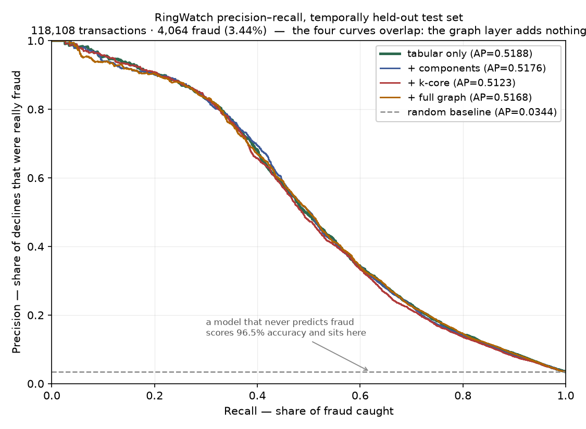
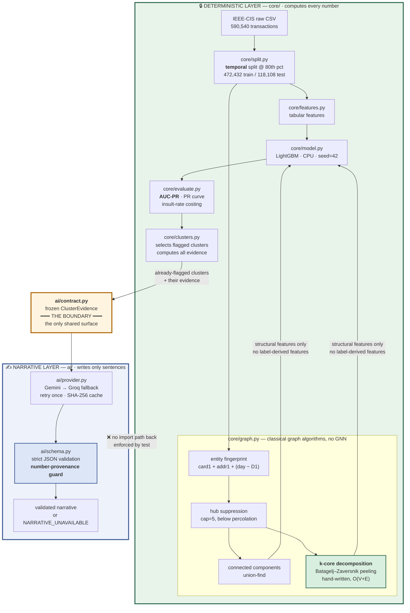
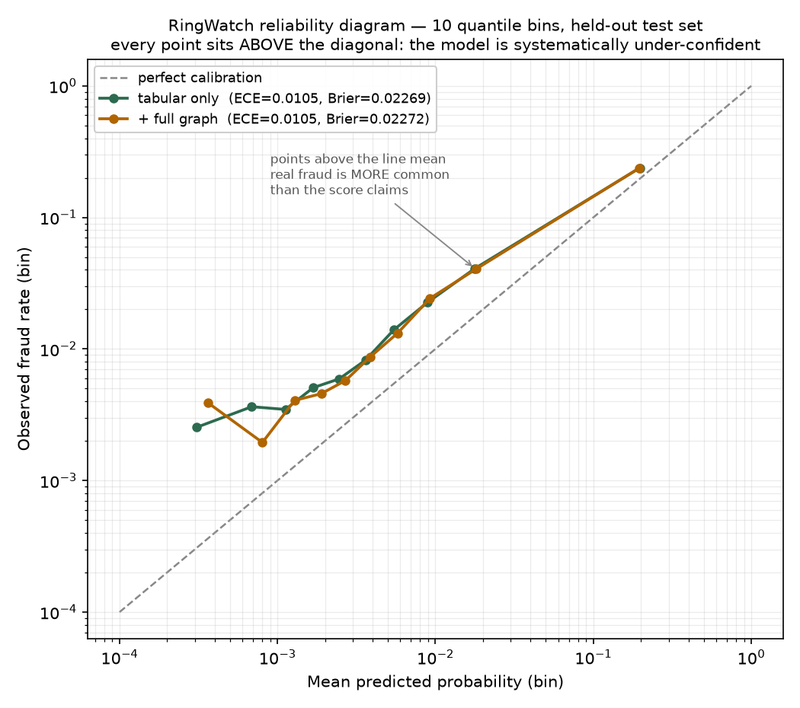

# RingWatch

**Graph-aware fraud ring detection with an enforced AI/determinism boundary.**

Razorpay AI Buildathon 2026 · Track 02 (AI Risk Manager)

**Live demo:** _(deploy in progress — see [Deploying the demo](#deploying-the-demo))_
· `GET /` dashboard · `POST /webhooks/razorpay` webhook receiver

> **What is live vs what is local.** The deployed service **renders committed results and
> receives webhooks. It never retrains, rescores, or recomputes a metric** — it has neither
> the 683 MB dataset nor the model cache, both of which are gitignored. Every figure on the
> dashboard comes from `docs/results.json`, produced locally by
> `scripts/export_results.py`. The full pipeline — download, temporal split, training, the
> four-variant ablation, the bootstrap — runs locally and takes several minutes of CPU.
>
> On the free tier the instance spins down after ~15 minutes idle, so **a first request can
> take 30–60 seconds**. The SQLite webhook log is ephemeral and does not survive a restart.
> Neither affects a reported metric.

> ## ⚠️ Detection-only
>
> RingWatch is **strictly a detection and analysis system.** It does not generate,
> simulate, optimize, or assist in producing adversarial, evasive, or fraudulent
> transactions, and contains no capability to do so. There is no attack simulation, no
> synthetic-fraud generation, and no adversarial-evasion tooling anywhere in this
> repository. This is both the Track 02 requirement and a design constraint the code
> structure honours.

---

## Problem statement

Card-testing rings, refund-abuse networks, and coordinated chargeback fraud don't look
like fraud one transaction at a time. Each individual payment can sit comfortably inside
a legitimate-looking distribution — modest amount, plausible merchant category, ordinary
hour — while the *coordination between* those payments is the only real signal. A
row-by-row classifier, no matter how well tuned, is structurally blind to it: it scores
each transaction independently and never sees that forty of them share a fingerprint.

RingWatch adds a classical graph layer over an entity graph to surface that coordination,
and — critically — measures honestly whether doing so actually helps.

## Why the evaluation harness is the deliverable

Razorpay's engineering team published a detailed writeup of their Oncall Agent, **Project
Viveka** — a multi-agent system that investigates production incidents and takes what was
a roughly 30-minute manual investigation down to about 90 seconds. It is a genuinely
impressive piece of engineering, and the writeup is unusually candid about its own
maturity: the system runs in shadow mode, is validated through informal feedback in Slack
threads, and works toward an accuracy target that is aspirational rather than measured.
Razorpay stated all of that openly. It is an open question they raised themselves, and
one that anyone who has shipped an AI system into production has run into.

That candour is what makes the buildathon brief's thesis land: **verification capacity,
not generation speed, is the bottleneck** in AI-native financial systems. RingWatch takes
that seriously as a working discipline rather than a slogan, and it is the reason this
project's centre of gravity is the evaluation harness rather than the model. Concretely:

- **AUC-PR instead of accuracy**, because at a 3.44% positive class a model that never
  predicts fraud scores 96.5% and catches nothing.
- **Bootstrap confidence intervals instead of raw deltas**, because a single-run
  difference of 0.002 is a number, not a result.
- **An honest negative finding as the headline** — the graph layer, which is the most
  interesting thing I built, does not work — rather than an inconvenience tuned away
  until the metrics agreed with the hypothesis.
- **An explicit register of what is and isn't validated**, including a deliberate refusal
  to make any calibration claim about the language model's own `confidence` field, which
  this data cannot support (see [Calibration](#calibration-are-the-probabilities-trustworthy)).

RingWatch does not claim to have solved evaluation for production incident-response AI.
That is a substantially harder problem than fraud-ring detection — incidents are rarer,
far more heterogeneous, and lack the clean labels a fraud dataset hands you. This is an
attempt to hold a smaller, more tractable problem to the standard Razorpay named.

## Headline result — including the part that didn't work

RingWatch set out to show that a classical graph layer improves fraud detection. **It
does not, and this README says so before it says anything else.**

Two findings, both measured, both defensible:

**1. Fraud genuinely clusters in the entity graph.** Testing *concentration* against a
label-permutation null: **12 fully-fraudulent connected components observed against
1.4 ± 1.2 expected by chance — z = +8.8**, stable across every hub-suppression cap tried
(+8.8 / +8.6 / +9.1). The ring structure is real.

**2. That structure does not convert into predictive lift.** Paired bootstrap, 400
resamples, both models scored on identical resampled test rows:

| variant | AUC-PR | Δ vs baseline | 95% CI | verdict |
|---|---|---|---|---|
| **tabular only** | **0.5188** | — | — | baseline |
| + components | 0.5176 | −0.0011 | [−0.0042, +0.0024] | not significant |
| + k-core | 0.5123 | −0.0064 | [−0.0102, −0.0031] | **significantly worse** |
| + full graph | 0.5168 | −0.0020 | [−0.0056, +0.0013] | not significant |

Baseline AUC-PR of 0.5188 against a 0.0344 prevalence floor is a **15.1× lift over
random**. The graph adds nothing to it.



The four curves are indistinguishable by eye, which is the honest picture of this result.
Regenerate with `python scripts/make_pr_curve.py`.

These two results are not in tension. The rings are real but **rare** — 12 of them —
and the graph reaches only **5.38% of test rows**. Twelve rings cannot move a metric
averaged over 118,108 transactions, while 433 tabular features already capture most of
the available signal. On the linked subgroup alone the point estimate does turn positive
(0.4118 → 0.4298, **+0.017**), but its CI spans zero: 6,354 rows containing 136 fraud
cases cannot resolve an effect that small.

### "But did you try giving the graph more coverage?"

Yes — that is the first objection, so it was tested rather than argued about. Re-running
the full pipeline at higher hub-suppression caps:

| cap | coverage of test rows | AUC-PR | Δ vs baseline |
|---|---|---|---|
| 5 *(shipped)* | 5.38% | 0.5168 | −0.0020 |
| 20 | 15.41% | 0.5191 | **+0.0003** |
| 50 | 26.18% | 0.5152 | −0.0036 |

Tripling coverage moves AUC-PR by +0.0003 — an order of magnitude *inside* the ±0.004
noise band established by the bootstrap above, and the cap-20 run exhausted its 2,000
boosting rounds without early stopping, making it the less trustworthy of the three.
Quintupling coverage makes things actively worse.

**Coverage is not the binding constraint.** The +0.0003 is reported here precisely
*because* it is positive and meaningless: selecting it as "the graph helps at cap 20"
would be exactly the p-hacking this project refused to do.

### Where the harm actually comes from

The ablation prints a breakdown of *where* graph features move scores, and the answer
was not the one the design predicted:

| group | rows | mean abs. Δ score | legit rows pushed >0.10 toward decline |
|---|---|---|---|
| **no entity resolved** | 12,234 | **0.0161** | **1.046%** |
| isolated (comp=1) | 99,520 | 0.0046 | 0.189% |
| comp 2 | 1,620 | 0.0050 | 0.316% |
| comp 3–4 | 2,963 | 0.0050 | 0.137% |
| comp 5+ | 1,771 | 0.0053 | 0.233% |

The largest perturbation — 3.5× any other group — is on rows where **no entity could be
resolved at all**, i.e. precisely where the graph has nothing to say. Graph columns are
NaN there, and the model re-learns the genuinely predictive missingness pattern (those
rows run 11.63% fraud vs 3.50% overall) more noisily than it already had from the null
`addr1`/`D1` columns. **That is noise injection, not ring confusion.**

The hypothesised failure mode — a legitimate customer inside a real cluster pushed toward
decline by topology alone — *does* occur, and the pipeline prints those rows too (e.g. a
27-entity component, core 2, legitimate, pushed 0.0818 → 0.2115). It is simply not the
dominant effect. Reporting the predicted case without the dominant one would have been
the tidier story and the wrong one.

**What the graph layer is therefore used for here:** surfacing statistically anomalous
clusters for analyst review — which is what it demonstrably does — and *not* feature-level
lift, which it demonstrably does not. k-core is retained and reported as the measured harm
case rather than quietly deleted, but is excluded from the recommended model
configuration, because shipping a configuration measured as worse would be indefensible.

The alternative was to keep trying link keys, aggregates and caps until something scored
above baseline. With enough configurations one of them would, by chance. That is
p-hacking, and it would not survive the interview question "how many variants did you
try?" See `FAILURE_LOG.md`, entry dated 17:40.

## Data

[IEEE-CIS Fraud Detection](https://www.kaggle.com/competitions/ieee-fraud-detection) —
590,540 labeled transactions, 394 columns, **3.4990% fraud rate**, spanning 182 days.
Labels are real and externally authored: I did not create this data and cannot tune it to
flatter the model.

## Architecture

The central structural rule: **one box computes numbers, a completely separate box writes
sentences, and code — not convention — prevents the second from touching the first.**



**How the boundary is enforced** — not by convention, but by three mechanisms:

1. **One-way imports.** `core/` imports `ai.contract` to build the handover object.
   `ai/` never imports `core/`. `tests/test_ai_boundary.py` parses the AST of every
   module under `ai/` and fails if any of them imports the engine or a modelling library.
   The LLM has no code path to a score.
2. **Frozen evidence.** `ClusterEvidence` is an immutable dataclass. The narrative layer
   physically cannot mutate what it was given.
3. **Number-provenance guard.** Every numeric token in the model's prose must already
   appear in the evidence. An invented rupee total, an invented count — even *correct*
   arithmetic the model performed itself — is rejected. Two failures and the cluster gets
   `NARRATIVE_UNAVAILABLE` rather than a guess.

No number RingWatch reports is produced, computed, or altered by the language model — the
AI layer only writes prose about numbers `core/` already finalized, and this boundary is
enforced by a test that walks the import graph, not by a comment asking nicely.

## The narrative layer, on real output

Running `python run.py --stage narrate` against the 12 clusters the deterministic engine
flagged: **11 of 12 produced validated narratives; 1 returned `NARRATIVE_UNAVAILABLE`**
after two Gemini timeouts. That failure was not staged — it is the degradation path
firing on a real transient network fault, which is better evidence than a unit test that
it works.

Two behaviours worth noting in the real output:

- **The number-provenance guard passed on all 11.** Every figure quoted in the prose
  (`48114.00 INR`, `k-core number of 2`, `max risk score of 0.7464`) was present in the
  evidence the model was handed. Nothing was invented, and nothing was derived.
- **The model frequently answers `BENIGN_COINCIDENCE`.** Most flagged clusters were
  described as ordinary shared household or business infrastructure rather than
  coordinated fraud. That is the prompt working as intended: telling an analyst a cluster
  is unremarkable is more useful than manufacturing a story for it, and a narrative layer
  that called everything fraud would be worthless.

Example (cluster 8, `SHARED_CREDENTIAL_REUSE`, confidence medium):

> Cluster 8 consists of 3 entities connected across 12 transactions over an activity span
> of 26 days, accumulating a total amount of 48114.00 INR. The graph topology shows a
> connected component size of 4, a k-core number of 2, and a max entity degree of 2, where
> all entities share card1, addr1, and P_emaildomain… The model flagged 6 transactions in
> this cluster, generating a mean risk score of 0.3318 and a max risk score of 0.7464.
>
> **Suggested action:** Inspect the 3 linked entities sharing card1 and addr1 to confirm
> user authorization or credential compromise.

Every number in that paragraph was computed by `core/`. The model chose the words.

## The webhook: what transfers to a new payment ecosystem, and what doesn't

The Razorpay webhook receiver is a real integration, not a decoration. Signatures are
verified with HMAC-SHA256 over the **raw request bytes** using `hmac.compare_digest`;
delivery is idempotent on `x-razorpay-event-id` because Razorpay delivers at-least-once;
and the endpoint returns 200 **before** any analysis runs, because Razorpay disables
endpoints slower than about five seconds.

The raw-body detail is the one worth dwelling on. Parsing the JSON and re-serialising it
produces different bytes for the same document — reordered keys, normalised whitespace,
`249900.00` collapsed to `249900.0` — so the HMAC no longer matches and verification fails
on payloads nobody tampered with. It presents as intermittent failures that look like an
upstream problem. `tests/test_webhook.py::test_reserialized_body_fails_verification`
reproduces exactly that and asserts the failure, so the constraint is pinned in executable
form.

### Building it surfaced a result worth reporting

The obvious feature — "score incoming payments with the trained model" — turns out not to
be honestly possible, and finding out why is more interesting than the feature would have
been.

**The classifier expects 433 features. A Razorpay payment payload supplies 3.** `card1`,
`card2` and `card5` are Vesta-internal identifiers, not card network or type; `addr1/2` and
`dist1/2` likewise; `C1–C14`, `D1–D15`, `M1–M9` and `V1–V339` — roughly 400 columns — are
Vesta's proprietary engineered features with no counterpart in any processor's webhook.
LightGBM will accept 430 missing values and return a number, but that number comes from a
model operating almost entirely outside its training distribution.

So the handler runs two tracks and the interface never lets them blur:

| | what it is | what it can claim |
|---|---|---|
| **Track 1 — graph structure** | Connected components and k-core over an entity graph built from Razorpay-native identifiers (card fingerprint, email domain, contact, VPA), using the **same implementations validated against networkx** in the test suite | A real computation. Topology assumes no distribution and was fitted to nothing, so it transfers intact |
| **Track 2 — model score** | The booster run with 430 features missing | **A demonstration of the ingestion path only.** Shown with a measured coverage figure — *"3 of 433 features present"* — not a vague disclaimer |

Verified locally on two test-mode payments from different payers sharing one card
fingerprint: Track 1 correctly placed them in a single component (size 2, core 2, linked on
`card_fingerprint` and `email_domain`), while Track 2 returned 0.0066 at **0.7% feature
coverage**.

**The contrast is the finding: the graph algorithms transfer across payment ecosystems, the
trained model does not.** Reporting that is more useful than quietly displaying a number
that means nothing — and stating it is the same discipline as reporting the negative
ablation above.

## Incremental k-core maintenance

Production fraud graphs update continuously; RingWatch rebuilds in batch. So the k-core
implementation was extended to maintain core numbers **incrementally** under edge
insertion, using the traversal/subcore approach from the streaming core-maintenance
literature (Sarıyüce et al.; Zhang et al. for the order-based alternative).

It rests on one result: inserting an edge (u, v) raises any core number by **at most 1**,
and only for vertices whose core number equals `min(core(u), core(v))`. That bounds the
blast radius, so a local repair is possible — collect the candidate subcore, peel it, and
promote the survivors.

### Correctness: exact, against the batch oracle

`core/graph.py` is untouched and serves as the oracle. Incremental core numbers must equal
a full rebuild **exactly**, at three tiers — random graphs asserted after *every single
insertion*, the pathological fixtures reused from the batch suite (barbell, wheel,
lollipop, karate, complete bipartite, ladder, star, path), and the real IEEE-CIS entity
graph replayed edge by edge. 37 tests, all exact-equality. The chain of trust runs
networkx → batch → incremental.

### The benchmark, and a prediction I got wrong

`PLAN_INCREMENTAL.md` recorded a prediction *before* any measurement: that incremental
maintenance would lose on this graph. **It was wrong, and by a wide margin.**

| graph | candidates/insert | per-insert | vs full rebuild |
|---|---|---|---|
| dense random — 20k nodes, 60k edges | 9,543 | 21,887 µs | crossover at **3 edges** |
| dense random — 5k nodes, 15k edges | 2,109 | 3,485 µs | bulk replay **667× slower** |
| sparse, entity-graph-shaped | 2.8 | 4.4 µs | crossover at 67% of edges |
| **real IEEE-CIS entity graph** | **2.8** | **2.0 µs** | **2.8× faster** (0.058 s vs 164 ms) |

I predicted a crossover at 1–5% of total edges; it is **282%** — you would have to insert
nearly three times the entire graph before batching became cheaper. Memory overhead is
+0.1 to +4.0 MB depending on size.

**The reason is density, and it inverts the answer.** On the real graph the affected
subcore per insertion is 2.8 vertices, so repairing three vertices beats peeling 208,914.
On dense graphs the "local" repair is not local — most vertices share a core number, the
candidate set becomes a large fraction of the graph, and every insertion re-peels it. My
error was noting the graph's sparsity and then not carrying the consequence through.

### When this is and isn't worth using

**Worth it:** sparse entity graphs with small components — which is what payment
fingerprint graphs actually look like — under genuine streaming, where updates arrive a few
at a time. At 2.0 µs per edge this comfortably keeps up with real transaction volume.

**Not worth it:** dense graphs, or bulk backfills. Above the crossover, rebuild. On a dense
graph incremental is catastrophically worse, not marginally so.

**Unmeasured, and a real limit on the claim:** the replay uses the **post-suppression**
edge set, so it never exercises a cap-crossing — yet the batch graph suppresses **8,852 hub
values**, each of which a faithful stream would hit as an edge *deletion*. Deletion is a
harder problem and is not implemented. The measured 2.8× is therefore an upper bound on
what a real streaming deployment would see.

```bash
python scripts/benchmark_incremental.py
```

## Ground-truth honesty

**IEEE-CIS provides transaction-level fraud labels, not ring-level labels.** RingWatch
therefore will never claim a metric like "N fraud rings caught" — that number cannot be
validated against this dataset, and reporting it would be fabrication. The two claims
this project makes are the two it can actually defend:

1. Fraud-labeled transactions **cluster more densely** in the entity graph than
   legitimate ones, demonstrated through graph statistics.
2. Graph-derived features produce a **measured PR-AUC lift** over an identical tabular
   baseline, demonstrated by ablation on a temporally held-out test set.

## Why AUC-PR and not accuracy

At a 3.4990% positive class, a model that predicts "never fraud" for every single
transaction achieves **96.5% accuracy** while catching zero fraud. Accuracy is not a
weak metric here, it is an actively misleading one. RingWatch optimizes and reports
**AUC-PR** (area under the precision-recall curve), reports the full precision/recall
curve, and defends a specific chosen operating threshold rather than hiding behind a
single aggregate.

False positives are costed explicitly as an **insult rate**: at the chosen threshold, how
many legitimate customers were wrongly declined, and what that costs in rupees under
named, documented assumptions (see the constants block at the top of `core/evaluate.py`).

### Two operating points, because one would have been misleading

| | [A] cost-minimising | [B] insult-constrained (≤1%) |
|---|---|---|
| threshold | 0.0438 | 0.2167 |
| precision | 0.3082 | **0.6355** |
| recall | **0.6309** | 0.4178 |
| fraud caught / missed | 2,564 / 1,500 | 1,698 / 2,366 |
| **legitimate customers declined** | **5,756** | **974** |
| insult rate | 5.047% | 0.854% |
| total expected cost | ₹3,38,95,246 | ₹4,07,47,202 |

Point [A] minimises expected rupee cost and is **operationally unshippable**: no payments
team declines 5% of legitimate traffic. The arithmetic is right; the model is incomplete.
It prices a missed fraud at the full transaction value plus a chargeback fee, but prices a
false positive at only the lost gross margin — because the lifetime-value damage of
insulting a good customer is deliberately **not monetised**, as putting a number on churn
would be inventing data. An unpriced cost reads to an optimiser as a free one.

So both are reported. The gap between them *is* the honest statement of what the missing
cost is doing, and every insult figure here is an **underestimate**.

## Calibration: are the probabilities trustworthy?

AUC-PR answers "does the model rank fraud above legitimate traffic?" — and it is invariant
to any monotonic rescaling of the scores, so a model can rank perfectly while its outputs
are meaningless as probabilities. That distinction is not academic here: the operating
threshold above is chosen by **minimising expected rupee cost**, and that arithmetic reads
each score as a probability. If the probabilities are wrong, the threshold is being placed
by a calculation resting on a number that does not mean what it says.

So it is measured (`python run.py --stage calibration`, reusing cached scores):

| model | Brier score | ECE | worst bin deviation |
|---|---|---|---|
| tabular only | 0.022686 | 0.010536 | 0.041069 |
| + full graph | 0.022723 | 0.010487 | 0.041874 |



**How to read the Brier score:** it conflates calibration with discrimination/refinement,
so it should not be read as a pure calibration metric on its own (per scikit-learn's
documentation) — a model can improve its Brier score purely by separating the classes
better, without becoming any better calibrated. **ECE** is reported alongside it because it
measures only the vertical distance from the diagonal, which is the quantity actually in
question here. Both are computed over 10 **quantile** bins rather than equal-width bins: at
a 3.44% positive rate the scores pile up near zero, and equal-width bins would put almost
every row in the first bin.

**The finding: the model is systematically under-confident.** In *every one* of the ten
bins, for both variants, the observed fraud rate exceeds the predicted probability — a bin
scoring 0.0178 contains 4.09% real fraud, and one scoring 0.0055 contains 1.40%. The
direction is consistent across three orders of magnitude, so this is bias, not noise.

That matters because it feeds directly back into the threshold discussion above. A model
whose probabilities are uniformly too low will have its cost-minimising threshold placed
too low as well, which is part of why operating point [A] declines an unshippable 5.047%
of legitimate traffic. The two findings are the same phenomenon seen from different angles.
Calibrating the scores (Platt scaling or isotonic regression on a held-out slice) is the
obvious next step and is **not** done here — it is listed in Limitations rather than
quietly implied.

On the graph layer: ECE 0.010536 → 0.010487 and Brier 0.022686 → 0.022723. As everywhere
else in this project, the graph features change nothing meaningful.

### Why the LLM's `confidence` field is left unvalidated

Each narrative carries a `confidence` of high/medium/low, and RingWatch makes **no claim
whatsoever** about whether that field is accurate. This is a deliberate refusal, not an
oversight.

Validating it would require knowing which flagged clusters are genuinely fraud rings. The
deterministic engine flags **12 clusters**, and IEEE-CIS has no ring-level ground truth to
check them against. Twelve observations cannot support a calibration claim about a
three-level field under any statistical standard — the confidence intervals would be wider
than the scale itself.

The only ways to manufacture a number would be to grade the LLM's confidence against the
transaction labels, or against the model's own risk score. Both are circular: the second
grades the narrative layer against the very engine that produced its input, and the first
substitutes a different question (is this transaction fraud?) for the one being asked (is
this cluster a ring?). Either would produce a confident-looking metric that means nothing.

That failure mode is precisely why the predecessor to this project was abandoned.
LedgerLoop authored its own synthetic data, injected its own breaks, and graded its own
matcher against ground truth it had also written — a closed loop that could only ever
confirm itself. Reporting an LLM confidence calibration here would be the same mistake in
a new costume. See `FAILURE_LOG.md`, entry 14:52.

## Limitations

Written as they are discovered, not reconstructed at the end.

- **No ring-level ground truth.** See above. Every ring-topology claim is a statement
  about graph structure and measured lift, never a validated ring count.
- **Entity resolution is a heuristic.** The `card1 + addr1 + (day − D1)` fingerprint is
  the competition-validated proxy for a customer ID, but it is a proxy. It will merge
  distinct customers who collide on all three, and split one customer across values when
  `D1` is null (0.21% of rows) or `addr1` is null (11.13% of rows).
- **`addr1` has only 332 distinct values** across 590k transactions, so it is a weak,
  hub-forming identifier. Graph construction applies hub suppression to prevent hairball
  components; the thresholds are documented and are a judgment call, not a derived
  optimum.
- **The identity table is sparse** — it covers a minority of transactions. The graph is
  deliberately **not** built on `DeviceInfo` or `id_30`–`id_33` for this reason; those
  columns would produce a mostly-disconnected graph of noise.
- **Single dataset.** Findings are demonstrated on IEEE-CIS only.
- **The graph layer does not improve prediction.** Stated at the top of this README and
  measured with bootstrap confidence intervals rather than asserted. The honest scope of
  the graph contribution is cluster surfacing, not lift.
- **Graph coverage is 5.38% of test rows**, a direct consequence of choosing a hub cap
  below the percolation threshold. A higher cap reaches more rows but dissolves the
  components into a hairball; that trade-off is measured, not guessed, but it is a
  trade-off with no good corner.
- **The linked-subgroup result is underpowered.** The +0.017 point estimate on linked
  rows is the most promising number in the project and it is *not* statistically
  significant. It is reported as a hypothesis for future work, not as a finding.
- **The amounts are USD, converted for reporting.** IEEE-CIS is US e-commerce data
  (Vesta). Rupee figures apply a documented FX assumption; they illustrate the costing
  method, and are not claims about Indian transaction values.
- **Cost assumptions are assumptions.** Margin rate, chargeback fee and FX are declared
  constants a reviewer can disagree with and re-run. Churn cost is unpriced entirely,
  which makes every insult cost an underestimate.
- **`confidence` in the LLM output is unvalidated, deliberately.** The field is
  schema-checked but nothing measures how often "high" is right, and with 12 flagged
  clusters and no ring-level ground truth, nothing here could. See
  [Why the LLM's `confidence` field is left unvalidated](#why-the-llms-confidence-field-is-left-unvalidated).
- **The classifier's probabilities are systematically under-confident** and are not
  recalibrated. Observed fraud exceeds predicted probability in every bin, which biases
  the cost-minimising threshold downward. Platt scaling or isotonic regression on a
  held-out slice is the obvious fix and is not implemented. See
  [Calibration](#calibration-are-the-probabilities-trustworthy).

## Deployment

Reproducible from a clean clone on CPU alone. **No GPU, no cloud compute, no Kaggle
account.** End-to-end cold run is roughly 20 minutes, dominated by training four model
variants for the ablation.

### 1. Environment

```bash
git clone <this-repo> && cd ringwatch
python3 -m venv .venv && source .venv/bin/activate
pip install -r requirements.txt
```

Tested on Python 3.14.6 with pandas 3.0.5, numpy 2.5.2, scikit-learn 1.9.0,
LightGBM 4.7.0, networkx 3.6.1. Needs ~4 GB RAM and ~2 GB disk.

### 2. Data

```bash
python scripts/fetch_data.py
```

Downloads `train_transaction.csv` (652 MB) and `train_identity.csv` (26 MB) from an
ungated mirror of the IEEE-CIS competition data and verifies row counts. The canonical
source is Kaggle, which requires an authenticated account that has accepted the
competition rules; the mirror keeps this repo reproducible for reviewers who have
neither. Integrity is re-checked on load — row count and fraud rate are asserted against
published values, so a truncated download fails loudly rather than quietly degrading a
metric.

### 3. Run the pipeline

```bash
python run.py --stage data       # build the Parquet cache, print split statistics
python run.py --stage graph      # entity graph + ring-concentration test
python run.py --stage ablation   # the four-variant comparison and the negative case
python run.py --stage all        # everything
```

Every stage is deterministic (fixed seeds, `deterministic=True` in LightGBM) and caches
its expensive artifacts under `data/cache/`, so re-runs are fast and reproduce identical
numbers.

### 4. Narratives (optional)

The LLM layer is the only part that needs network access or credentials, and **nothing
in the metrics depends on it**:

```bash
cp .env.example .env    # add GEMINI_API_KEY and/or GROQ_API_KEY
python run.py --stage narrate
```

Without keys, this stage reports `NARRATIVE_UNAVAILABLE` for every cluster and the rest
of the pipeline is unaffected. Responses are cached by SHA-256 of the prompt, so repeat
runs are free and reproducible.

### 5. The demo (dashboard + webhook)

```bash
python scripts/export_results.py     # freeze results -> docs/results.json
uvicorn app.main:app --reload        # http://localhost:8000
```

The dashboard renders `docs/results.json` and nothing else, enforced by the same
import-graph technique that guards the AI/determinism boundary:

- `test_dashboard_render_path_touches_no_computation` — `app/results.py` is the dashboard's
  entire relationship with the analysis, and it imports nothing from `core/` at all. **A
  page load cannot produce a number.**
- `test_app_modules_do_not_directly_import_modelling_libraries` — no request handler pulls
  a model into module scope.

Stated precisely, because the distinction matters: the **webhook** path *does* compute — it
reaches LightGBM through `core.demo_score` in a background task, which is the entire point
of the demonstration-scoring track described below. The guarantee is that the page
displaying the reported metrics has no path to producing one, not that the process contains
no computation anywhere.

To receive real webhooks locally, expose the port and point a **test-mode** Razorpay
webhook at it:

```bash
export RAZORPAY_WEBHOOK_SECRET=whsec_your_test_secret
cloudflared tunnel --url http://localhost:8000     # free, no account needed
```

### Deploying the demo

```bash
# 1. Push. render.yaml is a blueprint; Render reads it automatically.
# 2. On render.com: New > Blueprint > pick this repo.
# 3. Set RAZORPAY_WEBHOOK_SECRET in the Render dashboard (test mode only; it is
#    marked sync:false in render.yaml so it is never committed).
# 4. Point a Razorpay test-mode webhook at https://<your-service>.onrender.com/webhooks/razorpay
```

`artifacts/model_baseline.txt` (6.8 MB) is committed deliberately: `data/cache/` is
gitignored, and the deployed instance needs the booster for its clearly-labelled
out-of-distribution scoring track. If it is absent the app still starts and that track
reports "unavailable" — nothing else is affected.

### 6. Tests

```bash
pytest -q
```

Covers temporal-split correctness (including no-leakage under tied timestamps), the
k-core implementation against networkx as an independent oracle, the ring-concentration
statistic on planted and null structure, LLM JSON schema validation, the
number-provenance guard, and the AI/determinism import boundary.

## Legacy

`legacy/ledgerloop/` holds an earlier, abandoned Track 04 project, retained deliberately
with its git history. It was working code, dropped on purpose — the reasoning is entry #1
of `FAILURE_LOG.md`.
